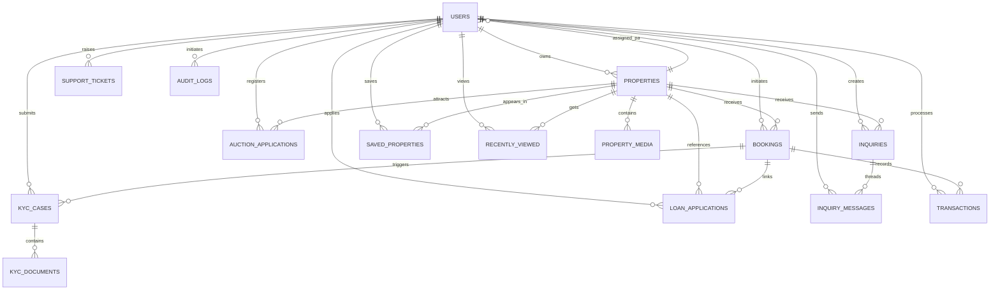

# HFCB Property Marketplace - Complete ER Diagram & Schema

## Visual ER Diagram (Mermaid)



---

## 1. Core Entity Tables

### 1.1 USERS Table
**Description**: Central authentication and profile repository for all platform users

```sql
CREATE TABLE users (
    -- Primary & Unique Identifiers
    id BIGINT PRIMARY KEY IDENTITY(1,1),
    customer_id INT UNIQUE NOT NULL,                    -- 9-digit sequential ID
    reference_id INT UNIQUE NOT NULL,                   -- 9-digit sequential ref
    
    -- Personal Information
    first_name NVARCHAR(100) NOT NULL,
    middle_name NVARCHAR(100) NULL,
    last_name NVARCHAR(100) NOT NULL,
    dob DATE NULL,
    nationality NVARCHAR(100) NULL,
    country NVARCHAR(100) NULL,
    
    -- Contact Information
    email NVARCHAR(100) UNIQUE NOT NULL,
    mobile_number NVARCHAR(15) UNIQUE NOT NULL,
    
    -- Identity & Compliance
    national_id NVARCHAR(20) UNIQUE NOT NULL,
    kra_pin NVARCHAR(20) NULL,
    
    -- Authentication & Authorization
    password_hash NVARCHAR(256) NULL,                   -- NULL for SSO staff
    role NVARCHAR(50) NOT NULL CHECK (role IN ('CUSTOMER', 'INTERNAL_PA', 'EXTERNAL_PA', 'ADMIN')),
    
    -- Status & Compliance
    is_active BIT NOT NULL DEFAULT 1,
    kyc_status NVARCHAR(50) NOT NULL DEFAULT 'PENDING' CHECK (kyc_status IN ('PENDING', 'VERIFIED', 'REJECTED', 'UNDER_REVIEW')),
    
    -- Audit & Concurrency
    version INT NOT NULL DEFAULT 0,
    created_at DATETIME2 NOT NULL DEFAULT SYSUTCDATETIME(),
    updated_at DATETIME2 NOT NULL DEFAULT SYSUTCDATETIME()
);

CREATE INDEX idx_users_email ON users(email);
CREATE INDEX idx_users_mobile ON users(mobile_number);
CREATE INDEX idx_users_national_id ON users(national_id);
CREATE INDEX idx_users_role ON users(role);
CREATE INDEX idx_users_kyc_status ON users(kyc_status);
```

---

### 1.2 PROPERTIES Table
**Description**: Unified catalog for all property listings (Buy, Rent, Auction, Commercial, Affordable Housing)

```sql
CREATE TABLE properties (
    -- Primary Identifier
    id BIGINT PRIMARY KEY IDENTITY(1,1),
    
    -- Foreign Keys
    owner_id BIGINT NULL REFERENCES users(id),         -- NULL for corporate/bank properties
    assigned_pa_id BIGINT NULL REFERENCES users(id),   -- Internal Property Advisor
    
    -- Property Classification
    property_type NVARCHAR(50) NOT NULL CHECK (property_type IN ('BUY_A_HOME', 'LAND_PLOTS', 'COMMERCIAL_PROPERTY', 'AUCTION', 'AFFORDABLE_HOUSING')),
    property_subtype NVARCHAR(50) NOT NULL,            -- e.g., Bungalow, Warehouse, Plot
    
    -- Basic Information
    name NVARCHAR(150) NOT NULL,
    location NVARCHAR(200) NOT NULL,
    description NVARCHAR(MAX) NOT NULL,
    
    -- Financial Details
    price DECIMAL(18,2) NOT NULL DEFAULT 0.00,         -- Purchase price
    monthly_rent DECIMAL(18,2) NOT NULL DEFAULT 0.00,  -- Rental price
    deposit_requirements NVARCHAR(500) NULL,           -- Rental deposit details
    open_market_value DECIMAL(18,2) NULL,              -- Auction valuation
    starting_bidding_price DECIMAL(18,2) NULL,         -- Auction start price
    
    -- Physical Specifications
    land_size DECIMAL(18,2) NULL,
    land_size_unit NVARCHAR(20) NULL CHECK (land_size_unit IN ('Acres', 'Hectares', 'Sq.Ft', 'Sq.M')),
    bedrooms INT NULL,
    bathrooms INT NULL,
    parking_spaces INT NULL,
    
    -- Construction & Timeline
    completion_status NVARCHAR(50) NULL CHECK (completion_status IN ('Under Construction', 'Ready to Move', 'Completed')),
    auction_date DATETIME2 NULL,
    
    -- Status Lifecycle
    availability_status NVARCHAR(50) NOT NULL CHECK (availability_status IN ('DRAFT', 'SUBMITTED', 'UNDER_REVIEW', 'REJECTED', 'APPROVED', 'PUBLISHED', 'LOCKED', 'RESERVED', 'SOLD')),
    
    -- Logical Deletion & Versioning
    is_deleted BIT NOT NULL DEFAULT 0,
    version INT NOT NULL DEFAULT 0,
    
    -- Audit Trail
    created_at DATETIME2 NOT NULL DEFAULT SYSUTCDATETIME(),
    updated_at DATETIME2 NOT NULL DEFAULT SYSUTCDATETIME()
);

CREATE INDEX idx_properties_owner_id ON properties(owner_id);
CREATE INDEX idx_properties_assigned_pa_id ON properties(assigned_pa_id);
CREATE INDEX idx_properties_type ON properties(property_type);
CREATE INDEX idx_properties_status ON properties(availability_status);
CREATE INDEX idx_properties_location ON properties(location);
CREATE INDEX idx_properties_is_deleted ON properties(is_deleted) WHERE is_deleted = 0;
```

---

### 1.3 BOOKINGS Table
**Description**: Core transactional engine tracking reservation lifecycle with 7-day countdown timer

```sql
CREATE TABLE bookings (
    -- Primary Identifier
    id BIGINT PRIMARY KEY IDENTITY(1,1),
    
    -- Foreign Keys
    property_id BIGINT NOT NULL REFERENCES properties(id),
    buyer_id BIGINT NOT NULL REFERENCES users(id),
    
    -- Booking Classification
    booking_type NVARCHAR(20) NOT NULL CHECK (booking_type IN ('PURCHASE', 'RENT')),
    
    -- Financial Details
    booking_fee DECIMAL(18,2) NOT NULL DEFAULT 5000.00,        -- Non-refundable
    deposit_charges DECIMAL(18,2) NOT NULL,                    -- From property config
    price_locked DECIMAL(18,2) NOT NULL,                       -- Locked property valuation
    
    -- Status Tracking
    booking_status NVARCHAR(50) NOT NULL CHECK (booking_status IN ('BOOKING_SUBMITTED', 'PAYMENT_SUCCESSFUL', 'RESERVED', 'BOOKED', 'UNDER_REVIEW', 'WAITLISTED', 'CANCELLED', 'COMPLETED')),
    
    -- Timer Management
    validity_start_time DATETIME2 NOT NULL,                    -- 7-day countdown start
    validity_expiry_time DATETIME2 NOT NULL,                   -- Initial 7-day expiry
    extension_status NVARCHAR(50) NOT NULL DEFAULT 'NONE' CHECK (extension_status IN ('NONE', 'REQUESTED', 'APPROVED', 'REJECTED')),
    final_expiry_time DATETIME2 NOT NULL,                      -- Expiry with extension
    
    -- Offer Letter Management
    offer_letter_id NVARCHAR(100) NULL,
    offer_letter_status NVARCHAR(50) NULL CHECK (offer_letter_status IN ('GENERATED', 'DOWNLOADED', 'SIGNED', 'UPLOADED', 'VERIFIED', 'REJECTED')),
    signed_offer_letter_url NVARCHAR(1000) NULL,               -- 14-day SLA tracking
    
    -- Audit & Concurrency
    version INT NOT NULL DEFAULT 0,
    created_at DATETIME2 NOT NULL DEFAULT SYSUTCDATETIME(),
    updated_at DATETIME2 NOT NULL DEFAULT SYSUTCDATETIME()
);

CREATE INDEX idx_bookings_property_id ON bookings(property_id);
CREATE INDEX idx_bookings_buyer_id ON bookings(buyer_id);
CREATE INDEX idx_bookings_status ON bookings(booking_status);
CREATE INDEX idx_bookings_validity_expiry ON bookings(validity_expiry_time);
CREATE INDEX idx_bookings_extension_status ON bookings(extension_status);
```

---

## 2. Compliance & KYC Tables

### 2.1 KYC_CASES Table
**Description**: Automated identity verification tracking with 3-attempt cap and manual escalation

```sql
CREATE TABLE kyc_cases (
    -- Primary Identifier
    id BIGINT PRIMARY KEY IDENTITY(1,1),
    
    -- Foreign Keys
    booking_id BIGINT NOT NULL REFERENCES bookings(id),
    user_id BIGINT NOT NULL REFERENCES users(id),
    property_id BIGINT NOT NULL REFERENCES properties(id),
    
    -- Verification Status
    kyc_status NVARCHAR(50) NOT NULL DEFAULT 'PENDING' CHECK (kyc_status IN ('PENDING', 'VERIFIED', 'UNDER_REVIEW', 'FAILED', 'PENDING_MANUAL_REVIEW')),
    
    -- IdentitySense Tracking (Automated Checks)
    identity_sense_attempts INT NOT NULL DEFAULT 0 CHECK (identity_sense_attempts <= 3),
    
    -- Timeline
    submission_time DATETIME2 NULL,
    approval_time DATETIME2 NULL,
    
    -- Rejection Details
    rejection_reason NVARCHAR(500) NULL,
    
    -- Audit Trail
    created_at DATETIME2 NOT NULL DEFAULT SYSUTCDATETIME(),
    updated_at DATETIME2 NOT NULL DEFAULT SYSUTCDATETIME()
);

CREATE INDEX idx_kyc_cases_booking_id ON kyc_cases(booking_id);
CREATE INDEX idx_kyc_cases_user_id ON kyc_cases(user_id);
CREATE INDEX idx_kyc_cases_status ON kyc_cases(kyc_status);
CREATE INDEX idx_kyc_cases_attempts ON kyc_cases(identity_sense_attempts);
```

---

### 2.2 KYC_DOCUMENTS Table
**Description**: Document metadata storage with format and size validation

```sql
CREATE TABLE kyc_documents (
    -- Primary Identifier
    id BIGINT PRIMARY KEY IDENTITY(1,1),
    
    -- Foreign Key
    kyc_case_id BIGINT NOT NULL REFERENCES kyc_cases(id),
    
    -- Document Classification
    document_type NVARCHAR(50) NOT NULL CHECK (document_type IN ('NATIONAL_ID', 'KRA_PIN', 'PAYSLIP', 'BANK_STATEMENT', 'MPESA_STATEMENT', 'OTHER')),
    
    -- File Information
    file_url NVARCHAR(1000) NOT NULL,
    file_format NVARCHAR(20) NOT NULL CHECK (file_format IN ('PDF', 'JPG', 'JPEG', 'PNG')),
    file_size_mb DECIMAL(5,2) NOT NULL CHECK (file_size_mb <= 6.00),
    
    -- Verification Status
    verification_status NVARCHAR(50) NOT NULL DEFAULT 'PENDING' CHECK (verification_status IN ('PENDING', 'APPROVED', 'REJECTED')),
    rejection_reason NVARCHAR(200) NULL,
    
    -- Audit Trail
    created_at DATETIME2 NOT NULL DEFAULT SYSUTCDATETIME(),
    updated_at DATETIME2 NOT NULL DEFAULT SYSUTCDATETIME()
);

CREATE INDEX idx_kyc_documents_kyc_case_id ON kyc_documents(kyc_case_id);
CREATE INDEX idx_kyc_documents_type ON kyc_documents(document_type);
```

---

## 3. Transaction & Financial Tables

### 3.1 TRANSACTIONS Table
**Description**: Complete financial ledger for booking fees, deposits, and payments

```sql
CREATE TABLE transactions (
    -- Primary Identifier
    id BIGINT PRIMARY KEY IDENTITY(1,1),
    
    -- Foreign Keys
    booking_id BIGINT NOT NULL REFERENCES bookings(id),
    user_id BIGINT NOT NULL REFERENCES users(id),
    
    -- Transaction Details
    amount DECIMAL(18,2) NOT NULL,
    transaction_type NVARCHAR(50) NOT NULL CHECK (transaction_type IN ('BOOKING_FEE', 'FIRST_DEPOSIT', 'RENT_DEPOSIT', 'REFUND')),
    payment_method NVARCHAR(50) NOT NULL CHECK (payment_method IN ('MPESA', 'NET_BANKING', 'CARD', 'OFFLINE_BANK')),
    
    -- Transaction Tracking
    transaction_reference NVARCHAR(100) UNIQUE NOT NULL,
    status NVARCHAR(50) NOT NULL DEFAULT 'PENDING' CHECK (status IN ('PENDING', 'SUCCESS', 'FAILED', 'REVERSED')),
    
    -- Timeline
    payment_date DATETIME2 NULL,
    
    -- Audit Trail
    created_at DATETIME2 NOT NULL DEFAULT SYSUTCDATETIME(),
    updated_at DATETIME2 NOT NULL DEFAULT SYSUTCDATETIME()
);

CREATE INDEX idx_transactions_booking_id ON transactions(booking_id);
CREATE INDEX idx_transactions_user_id ON transactions(user_id);
CREATE INDEX idx_transactions_status ON transactions(status);
CREATE INDEX idx_transactions_type ON transactions(transaction_type);
CREATE INDEX idx_transactions_reference ON transactions(transaction_reference);
```

---

### 3.2 LOAN_APPLICATIONS Table
**Description**: Mortgage calculator results and CRM pipeline integration

```sql
CREATE TABLE loan_applications (
    -- Primary Identifier
    id BIGINT PRIMARY KEY IDENTITY(1,1),
    
    -- Foreign Keys
    booking_id BIGINT NOT NULL REFERENCES bookings(id),
    user_id BIGINT NOT NULL REFERENCES users(id),
    property_id BIGINT NOT NULL REFERENCES properties(id),
    
    -- Loan Details
    requested_amount DECIMAL(18,2) NOT NULL,
    estimated_emi DECIMAL(18,2) NOT NULL,
    tenure_years INT NOT NULL CHECK (tenure_years > 0 AND tenure_years <= 30),
    
    -- Document Requirements
    bank_statement_url NVARCHAR(1000) NOT NULL,      -- Mandatory PDF
    salary_payslip_url NVARCHAR(1000) NULL,
    mpesa_statement_url NVARCHAR(1000) NULL,
    
    -- Status Tracking
    status NVARCHAR(50) NOT NULL DEFAULT 'LEAD_CAPTURED' CHECK (status IN ('LEAD_CAPTURED', 'SUBMITTED', 'UNDER_REVIEW', 'APPROVED', 'REJECTED', 'FUNDED')),
    
    -- Audit Trail
    created_at DATETIME2 NOT NULL DEFAULT SYSUTCDATETIME(),
    updated_at DATETIME2 NOT NULL DEFAULT SYSUTCDATETIME()
);

CREATE INDEX idx_loan_applications_booking_id ON loan_applications(booking_id);
CREATE INDEX idx_loan_applications_user_id ON loan_applications(user_id);
CREATE INDEX idx_loan_applications_status ON loan_applications(status);
```

---

## 4. Content & Media Tables

### 4.1 PROPERTY_MEDIA Table
**Description**: Media assets for properties (images, videos, documents)

```sql
CREATE TABLE property_media (
    -- Primary Identifier
    id BIGINT PRIMARY KEY IDENTITY(1,1),
    
    -- Foreign Key
    property_id BIGINT NOT NULL REFERENCES properties(id),
    
    -- Media Details
    media_type NVARCHAR(50) NOT NULL CHECK (media_type IN ('IMAGE', 'VIDEO', 'DOCUMENT', 'FLOOR_PLAN', 'VIRTUAL_TOUR')),
    media_url NVARCHAR(1000) NOT NULL,
    display_order INT NULL,                            -- For image sequencing
    
    -- Audit Trail
    created_at DATETIME2 NOT NULL DEFAULT SYSUTCDATETIME()
);

CREATE INDEX idx_property_media_property_id ON property_media(property_id);
CREATE INDEX idx_property_media_type ON property_media(media_type);
```

---

## 5. Customer Engagement Tables

### 5.1 INQUIRIES Table
**Description**: Prospective buyer inquiries and site visit scheduling

```sql
CREATE TABLE inquiries (
    -- Primary Identifier
    id BIGINT PRIMARY KEY IDENTITY(1,1),
    
    -- Foreign Keys
    property_id BIGINT NOT NULL REFERENCES properties(id),
    user_id BIGINT NULL REFERENCES users(id),         -- NULL for guest inquiries
    
    -- Inquiry Details
    full_name NVARCHAR(100) NOT NULL,
    email NVARCHAR(100) NOT NULL,
    mobile_number NVARCHAR(15) NOT NULL,
    inquiry_type NVARCHAR(50) NOT NULL,               -- e.g., GENERAL, VIEWING, OFFER
    message NVARCHAR(1000) NOT NULL,
    
    -- Contact Preferences
    preferred_contact_method NVARCHAR(20) NULL CHECK (preferred_contact_method IN ('Call', 'Email', 'SMS')),
    preferred_contact_time NVARCHAR(100) NULL,
    communication_consent BIT NOT NULL DEFAULT 0,     -- Must be 1 to submit
    
    -- Site Visit Management
    site_visit_requested BIT NOT NULL DEFAULT 0,
    site_visit_date_time DATETIME2 NULL,
    
    -- Status Tracking
    inquiry_status NVARCHAR(50) NOT NULL DEFAULT 'PENDING' CHECK (inquiry_status IN ('PENDING', 'OPEN', 'RESOLVED', 'CLOSED')),
    
    -- Audit Trail
    created_at DATETIME2 NOT NULL DEFAULT SYSUTCDATETIME(),
    updated_at DATETIME2 NOT NULL DEFAULT SYSUTCDATETIME()
);

CREATE INDEX idx_inquiries_property_id ON inquiries(property_id);
CREATE INDEX idx_inquiries_user_id ON inquiries(user_id);
CREATE INDEX idx_inquiries_status ON inquiries(inquiry_status);
CREATE INDEX idx_inquiries_site_visit ON inquiries(site_visit_requested);
```

---

### 5.2 INQUIRY_MESSAGES Table
**Description**: Threaded conversation history for inquiries

```sql
CREATE TABLE inquiry_messages (
    -- Primary Identifier
    id BIGINT PRIMARY KEY IDENTITY(1,1),
    
    -- Foreign Keys
    inquiry_id BIGINT NOT NULL REFERENCES inquiries(id),
    sender_id BIGINT NULL REFERENCES users(id),       -- NULL for guest messages
    
    -- Message Content
    message_text NVARCHAR(MAX) NOT NULL,
    
    -- Audit Trail
    sent_at DATETIME2 NOT NULL DEFAULT SYSUTCDATETIME()
);

CREATE INDEX idx_inquiry_messages_inquiry_id ON inquiry_messages(inquiry_id);
CREATE INDEX idx_inquiry_messages_sender_id ON inquiry_messages(sender_id);
```

---

### 5.3 AUCTION_APPLICATIONS Table
**Description**: Expression of interest for distressed property events

```sql
CREATE TABLE auction_applications (
    -- Primary Identifier
    id BIGINT PRIMARY KEY IDENTITY(1,1),
    
    -- Foreign Keys
    property_id BIGINT NOT NULL REFERENCES properties(id),
    user_id BIGINT NULL REFERENCES users(id),         -- NULL for guests
    
    -- Applicant Details
    national_id NVARCHAR(20) NOT NULL,                -- Duplication key for guest validation
    full_name NVARCHAR(100) NOT NULL,
    email NVARCHAR(100) NOT NULL,
    mobile_number NVARCHAR(15) NOT NULL,
    
    -- Status Tracking
    status NVARCHAR(50) NOT NULL DEFAULT 'SUBMITTED' CHECK (status IN ('SUBMITTED', 'UNDER_REVIEW', 'APPROVED', 'REJECTED')),
    
    -- Audit Trail
    submitted_at DATETIME2 NOT NULL DEFAULT SYSUTCDATETIME()
);

CREATE INDEX idx_auction_applications_property_id ON auction_applications(property_id);
CREATE INDEX idx_auction_applications_user_id ON auction_applications(user_id);
CREATE INDEX idx_auction_applications_status ON auction_applications(status);
```

---

## 6. Customer Preference Tables

### 6.1 SAVED_PROPERTIES Table (Wishlist)
**Description**: User wishlist/saved properties

```sql
CREATE TABLE saved_properties (
    -- Composite Primary Key
    user_id BIGINT NOT NULL REFERENCES users(id),
    property_id BIGINT NOT NULL REFERENCES properties(id),
    
    -- Audit Trail
    saved_at DATETIME2 NOT NULL DEFAULT SYSUTCDATETIME(),
    
    PRIMARY KEY (user_id, property_id)
);

CREATE INDEX idx_saved_properties_user_id ON saved_properties(user_id);
CREATE INDEX idx_saved_properties_property_id ON saved_properties(property_id);
```

---

### 6.2 RECENTLY_VIEWED Table
**Description**: User browsing history

```sql
CREATE TABLE recently_viewed (
    -- Primary Identifier
    id BIGINT PRIMARY KEY IDENTITY(1,1),
    
    -- Foreign Keys
    user_id BIGINT NOT NULL REFERENCES users(id),
    property_id BIGINT NOT NULL REFERENCES properties(id),
    
    -- Audit Trail
    viewed_at DATETIME2 NOT NULL DEFAULT SYSUTCDATETIME()
);

CREATE INDEX idx_recently_viewed_user_id ON recently_viewed(user_id);
CREATE INDEX idx_recently_viewed_property_id ON recently_viewed(property_id);
CREATE INDEX idx_recently_viewed_viewed_at ON recently_viewed(viewed_at);
```

---

## 7. Support & Communication Tables

### 7.1 SUPPORT_TICKETS Table
**Description**: Support ticket management with CRM synchronization

```sql
CREATE TABLE support_tickets (
    -- Primary Identifier
    id BIGINT PRIMARY KEY IDENTITY(1,1),
    
    -- Foreign Key
    user_id BIGINT NOT NULL REFERENCES users(id),
    
    -- CRM Integration
    crm_service_request_id NVARCHAR(100) UNIQUE NOT NULL,
    
    -- Ticket Details
    issue_category NVARCHAR(100) NOT NULL,
    issue_details NVARCHAR(1000) NOT NULL,
    
    -- Status Tracking
    ticket_status NVARCHAR(50) NOT NULL CHECK (ticket_status IN ('OPEN', 'ASSIGNED', 'IN_PROGRESS', 'RESOLVED', 'CLOSED')),
    
    -- Satisfaction Rating
    feedback_rating INT NULL CHECK (feedback_rating >= 1 AND feedback_rating <= 5),
    
    -- Audit Trail
    created_at DATETIME2 NOT NULL DEFAULT SYSUTCDATETIME(),
    updated_at DATETIME2 NOT NULL DEFAULT SYSUTCDATETIME()
);

CREATE INDEX idx_support_tickets_user_id ON support_tickets(user_id);
CREATE INDEX idx_support_tickets_status ON support_tickets(ticket_status);
CREATE INDEX idx_support_tickets_crm_id ON support_tickets(crm_service_request_id);
```

---

## 8. System Audit & Compliance Tables

### 8.1 AUDIT_LOGS Table
**Description**: Platform-level user behavior and security event tracking

```sql
CREATE TABLE audit_logs (
    -- Primary Identifier
    id BIGINT PRIMARY KEY IDENTITY(1,1),
    
    -- User Reference
    user_id BIGINT NULL REFERENCES users(id),         -- NULL for unauthorized attempts
    
    -- Action Tracking
    action_type NVARCHAR(100) NOT NULL CHECK (action_type IN ('LOGIN', 'REGISTER', 'PASSWORD_RESET', 'PASSWORD_CHANGE', 'PROPERTY_LOCK', 'TIMER_EXPIRED', 'REFUND_REQUESTED', 'OFFER_LETTER_GENERATED', 'KYC_SUBMISSION', 'KYC_FAILED', 'EXTENSION_REQUESTED', 'EXTENSION_APPROVED', 'EXTENSION_REJECTED')),
    
    -- Action Details (JSON payload for pre/post state)
    action_details NVARCHAR(MAX) NOT NULL,            -- JSON string with state changes
    
    -- Security Context
    ip_address NVARCHAR(45) NULL,
    user_agent NVARCHAR(500) NULL,
    
    -- Audit Trail
    timestamp DATETIME2 NOT NULL DEFAULT SYSUTCDATETIME()
);

CREATE INDEX idx_audit_logs_user_id ON audit_logs(user_id);
CREATE INDEX idx_audit_logs_action_type ON audit_logs(action_type);
CREATE INDEX idx_audit_logs_timestamp ON audit_logs(timestamp);
```

---

### 8.2 API_REQUEST_LOGS Table
**Description**: REST API trace flows and diagnostic details

```sql
CREATE TABLE api_request_logs (
    -- Primary Identifier
    id BIGINT PRIMARY KEY IDENTITY(1,1),
    
    -- Request Tracing (B3 Headers)
    trace_id NVARCHAR(100) NOT NULL,                  -- X-B3-TraceId for correlation
    
    -- Request Details
    request_uri NVARCHAR(256) NOT NULL,
    http_method NVARCHAR(10) NOT NULL CHECK (http_method IN ('GET', 'POST', 'PUT', 'PATCH', 'DELETE')),
    
    -- Payload Logging
    request_payload NVARCHAR(MAX) NULL,               -- Raw incoming request JSON
    response_payload NVARCHAR(MAX) NULL,              -- Raw outgoing response JSON
    
    -- Response Details
    http_status INT NOT NULL,
    
    -- Performance Metrics
    duration_ms BIGINT NOT NULL,                      -- Execution time in milliseconds
    
    -- Security Context
    client_ip NVARCHAR(45) NULL,
    user_id BIGINT NULL REFERENCES users(id),
    
    -- Audit Trail
    timestamp DATETIME2 NOT NULL DEFAULT SYSUTCDATETIME()
);

CREATE INDEX idx_api_request_logs_trace_id ON api_request_logs(trace_id);
CREATE INDEX idx_api_request_logs_request_uri ON api_request_logs(request_uri);
CREATE INDEX idx_api_request_logs_http_status ON api_request_logs(http_status);
CREATE INDEX idx_api_request_logs_timestamp ON api_request_logs(timestamp);
CREATE INDEX idx_api_request_logs_duration_ms ON api_request_logs(duration_ms);
```

---

## 9. Master Tables

### 9.1 PROPERTY_CATEGORIES Master Table
**Description**: Enumeration of property categories

```sql
CREATE TABLE property_categories (
    -- Primary Identifier
    id INT PRIMARY KEY IDENTITY(1,1),
    
    -- Category Details
    category_name NVARCHAR(100) UNIQUE NOT NULL CHECK (category_name IN ('Buy a Home', 'Land/Plots', 'Commercial Property', 'Auction', 'Affordable Housing')),
    category_code NVARCHAR(50) UNIQUE NOT NULL,
    is_active BIT NOT NULL DEFAULT 1,
    display_order INT NOT NULL,
    
    -- Metadata
    description NVARCHAR(500) NULL,
    icon_url NVARCHAR(500) NULL,
    
    -- Audit Trail
    created_at DATETIME2 NOT NULL DEFAULT SYSUTCDATETIME(),
    updated_at DATETIME2 NOT NULL DEFAULT SYSUTCDATETIME()
);
```

---

### 9.2 PROPERTY_SUBTYPES Master Table
**Description**: Sub-classification for property types

```sql
CREATE TABLE property_subtypes (
    -- Primary Identifier
    id INT PRIMARY KEY IDENTITY(1,1),
    
    -- Category Reference
    category_id INT NOT NULL REFERENCES property_categories(id),
    
    -- Subtype Details
    subtype_name NVARCHAR(100) NOT NULL,
    subtype_code NVARCHAR(50) NOT NULL,
    is_active BIT NOT NULL DEFAULT 1,
    
    -- Metadata
    description NVARCHAR(500) NULL,
    
    -- Audit Trail
    created_at DATETIME2 NOT NULL DEFAULT SYSUTCDATETIME(),
    
    UNIQUE (category_id, subtype_code)
);
```

---

### 9.3 USER_ROLES Master Table
**Description**: System roles and permissions

```sql
CREATE TABLE user_roles (
    -- Primary Identifier
    id INT PRIMARY KEY IDENTITY(1,1),
    
    -- Role Details
    role_name NVARCHAR(50) UNIQUE NOT NULL CHECK (role_name IN ('CUSTOMER', 'INTERNAL_PA', 'EXTERNAL_PA', 'ADMIN')),
    role_code NVARCHAR(50) UNIQUE NOT NULL,
    
    -- Metadata
    description NVARCHAR(500) NULL,
    is_active BIT NOT NULL DEFAULT 1,
    
    -- Audit Trail
    created_at DATETIME2 NOT NULL DEFAULT SYSUTCDATETIME()
);
```

---

### 9.4 DOCUMENT_TYPES Master Table
**Description**: Valid KYC document classifications

```sql
CREATE TABLE document_types (
    -- Primary Identifier
    id INT PRIMARY KEY IDENTITY(1,1),
    
    -- Document Type Details
    type_name NVARCHAR(100) UNIQUE NOT NULL,
    type_code NVARCHAR(50) UNIQUE NOT NULL,
    
    -- Validation Rules
    is_mandatory BIT NOT NULL DEFAULT 0,
    allowed_formats NVARCHAR(100) NOT NULL,           -- CSV of formats
    max_file_size_mb DECIMAL(5,2) NOT NULL,
    
    -- Metadata
    description NVARCHAR(500) NULL,
    is_active BIT NOT NULL DEFAULT 1,
    
    -- Audit Trail
    created_at DATETIME2 NOT NULL DEFAULT SYSUTCDATETIME()
);
```

---

### 9.5 PAYMENT_METHODS Master Table
**Description**: Supported payment channels

```sql
CREATE TABLE payment_methods (
    -- Primary Identifier
    id INT PRIMARY KEY IDENTITY(1,1),
    
    -- Payment Method Details
    method_name NVARCHAR(100) UNIQUE NOT NULL CHECK (method_name IN ('MPESA', 'NET_BANKING', 'CARD', 'OFFLINE_BANK')),
    method_code NVARCHAR(50) UNIQUE NOT NULL,
    
    -- Configuration
    is_active BIT NOT NULL DEFAULT 1,
    is_available_for_booking_fee BIT NOT NULL DEFAULT 1,
    is_available_for_deposit BIT NOT NULL DEFAULT 1,
    
    -- Metadata
    description NVARCHAR(500) NULL,
    
    -- Audit Trail
    created_at DATETIME2 NOT NULL DEFAULT SYSUTCDATETIME()
);
```

---

### 9.6 SYSTEM_CONFIGURATIONS Master Table
**Description**: Platform-wide configuration parameters

```sql
CREATE TABLE system_configurations (
    -- Primary Identifier
    id INT PRIMARY KEY IDENTITY(1,1),
    
    -- Configuration Details
    config_key NVARCHAR(100) UNIQUE NOT NULL,
    config_value NVARCHAR(MAX) NOT NULL,
    
    -- Metadata
    config_type NVARCHAR(50) NOT NULL CHECK (config_type IN ('STRING', 'INTEGER', 'DECIMAL', 'BOOLEAN', 'JSON')),
    description NVARCHAR(500) NULL,
    
    -- Versioning
    is_active BIT NOT NULL DEFAULT 1,
    created_at DATETIME2 NOT NULL DEFAULT SYSUTCDATETIME(),
    updated_at DATETIME2 NOT NULL DEFAULT SYSUTCDATETIME(),
    
    -- Example keys:
    -- BOOKING_FEE_AMOUNT = 5000.00
    -- PAYMENT_TIMER_DAYS = 7
    -- KYC_ATTEMPT_LIMIT = 3
    -- OFFER_LETTER_SLA_DAYS = 14
    -- OTP_COOLDOWN_SECONDS = 120
    -- PASSWORD_EXPIRY_DAYS = 90
    -- PASSWORD_REMINDER_DAYS = 15
    UNIQUE(config_key)
);
```

---

## 10. Complete Relationship Summary

```
USERS (1) ──────────────────────────────────────────────────────────────────────────────────────────────────────────────────────────────────────────── (N) PROPERTIES
    │                                                                                                                                                          │
    │                                                                                                                                                          ├─ owner_id
    │                                                                                                                                                          ├─ assigned_pa_id
    │                                                                                                                                                          └─ (1) PROPERTY_MEDIA
    │
    ├─ (1) BOOKINGS ────────────────────────────────┬─ (1) KYC_CASES ────────────────────────────────── (1) KYC_DOCUMENTS
    │                                               │
    │                                               ├─ (1) TRANSACTIONS
    │                                               │
    │                                               └─ (1) LOAN_APPLICATIONS
    │
    ├─ (1) INQUIRIES ────────────────────────────── (N) INQUIRY_MESSAGES
    │
    ├─ (1) AUCTION_APPLICATIONS
    │
    ├─ (N) SAVED_PROPERTIES ─────────────────────── PROPERTIES
    │
    ├─ (N) RECENTLY_VIEWED ──────────────────────── PROPERTIES
    │
    ├─ (1) SUPPORT_TICKETS
    │
    ├─ (N) AUDIT_LOGS
    │
    └─ (N) API_REQUEST_LOGS


PROPERTY_CATEGORIES (1) ─���──────────────────────────── (N) PROPERTY_SUBTYPES
```

---

## 11. Mandatory Audit Fields (Applied to All Tables)

All transactional tables include the following audit trail fields:

| Field Name | Data Type | Purpose |
|-----------|-----------|---------|
| `created_at` | DATETIME2 | Record creation timestamp (UTC) |
| `updated_at` | DATETIME2 | Last modification timestamp (UTC) |
| `version` | INT | Optimistic concurrency lock counter (transactional tables only) |

**Audit Capture Strategy**:
- Use `SYSUTCDATETIME()` for automatic UTC timestamps
- Temporal tables (SYSTEM_VERSIONED) for automatic change tracking on `users`, `properties`, `bookings`, `transactions`
- Explicit audit_logs table for security-sensitive actions (login, KYC, payment, rejection events)
- API trace logs (api_request_logs) for request/response diagnostics

---

## 12. Key Business Constraints

### Concurrency & Locking
- Optimistic locking via `version` field on transactional tables
- Pessimistic lock on property availability check during booking (`SELECT ... WITH (UPDLOCK)`)
- Foreign key constraints enforce referential integrity

### State Machine Validations
- Property lifecycle: `DRAFT` → `SUBMITTED` → `UNDER_REVIEW` → {`REJECTED`, `APPROVED`} → `PUBLISHED` → {`RESERVED`, `SOLD`}
- Booking lifecycle: `BOOKING_SUBMITTED` → `PAYMENT_SUCCESSFUL` → `RESERVED` → `BOOKED` → {`COMPLETED`, `CANCELLED`, `WAITLISTED`}
- KYC lifecycle: `PENDING` → {`VERIFIED`, `FAILED`, `UNDER_REVIEW`, `PENDING_MANUAL_REVIEW`}

### Financial Controls
- Booking fee: Fixed KES 5,000 (non-refundable)
- 7-day unified countdown: From `PAYMENT_SUCCESSFUL` to deposit deadline
- Extension allowance: +1 to +2 calendar days (manual approval only)
- 14-day Offer Letter SLA: Separate from payment timer

### Security Rules
- OTP resend: 120-second cooldown, max 3 attempts
- Password expiry: 90 days with 15-day reminder
- Staff SSO lock: Corporate emails blocked from standard registration
- Failed password attempts: 3 consecutive failures trigger recovery channel verification

