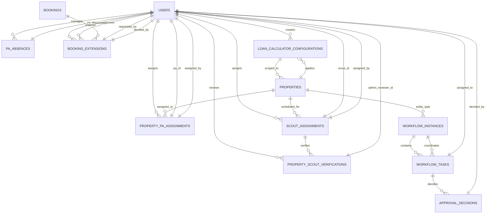

# HFCB Property Marketplace - Admin Workflow ER Diagram v2.0

**Version**: 2.0  
**Date**: September 2026  
**Module Integration**: Admin Module Part 3 (v24.0), Property Scout Module (v18.1), Internal Property Advisor Module (v20.0)

---

## 1. Admin Workflow System Overview

The Admin Workflow System encompasses three critical operational domains:
1. **PA Availability Management** - Track Property Advisor absences and auto-revert statuses
2. **Booking Extension Approvals** - Manage 7-day extension requests with audit trails
3. **Loan Calculator Configuration** - Global and property-specific loan parameters

---

## 2. Admin Workflow ER Diagram (Mermaid)



---

## 3. Admin Workflow Table Schemas

### 3.1 PA_ABSENCES Table

**Purpose**: Track Property Advisor availability calendar with automatic status reversion

```sql
CREATE TABLE pa_absences (
    -- Primary Identifier
    id BIGINT PRIMARY KEY IDENTITY(1,1),
    
    -- Foreign Key
    pa_id BIGINT NOT NULL REFERENCES users(id),
    
    -- Absence Period
    absent_from DATE NOT NULL,
    absent_to DATE NOT NULL,
    
    -- Status Tracking
    status NVARCHAR(50) NOT NULL DEFAULT 'ABSENT' CHECK (status IN ('ABSENT', 'PRESENT')),
    
    -- Audit Trail
    created_at DATETIME2 NOT NULL DEFAULT SYSUTCDATETIME(),
    updated_at DATETIME2 NOT NULL DEFAULT SYSUTCDATETIME(),
    created_by BIGINT NULL REFERENCES users(id),
    updated_by BIGINT NULL REFERENCES users(id),
    version INT NOT NULL DEFAULT 1,
    
    CONSTRAINT fk_pa_absences_pa FOREIGN KEY (pa_id) REFERENCES users(id)
);

CREATE INDEX idx_pa_absences_pa_id ON pa_absences(pa_id);
CREATE INDEX idx_pa_absences_date_range ON pa_absences(pa_id, absent_from, absent_to);
CREATE INDEX idx_pa_absences_status ON pa_absences(status);
```

**Key Business Rules**:
- Absence period defines calendar start and end dates
- Status field defaults to 'ABSENT' on creation
- Daily scheduler at 00:01 AM evaluates expiry:
  - If `absent_to < TODAY()`, status automatically transitions to 'PRESENT'
  - If `absent_from = TODAY()`, status automatically transitions to 'ABSENT'
- Used to determine PA availability during property assignment workflows

---

### 3.2 BOOKING_EXTENSIONS Table

**Purpose**: Manage 7-day booking validity extension requests with approval audit trail

```sql
CREATE TABLE booking_extensions (
    -- Primary Identifier
    id BIGINT PRIMARY KEY IDENTITY(1,1),
    
    -- Foreign Keys
    booking_id BIGINT NOT NULL REFERENCES bookings(id) ON DELETE CASCADE,
    requested_by BIGINT NOT NULL REFERENCES users(id),
    decided_by BIGINT NULL REFERENCES users(id),
    
    -- Extension Parameters
    requested_days INT NOT NULL DEFAULT 7 CHECK (requested_days = 7),
    approved_days INT NULL,
    
    -- Request Details
    reason NVARCHAR(500) NOT NULL,
    
    -- Status Tracking
    status NVARCHAR(50) NOT NULL DEFAULT 'PENDING' CHECK (status IN ('PENDING', 'APPROVED', 'REJECTED')),
    
    -- Timeline
    requested_at DATETIME2 NOT NULL DEFAULT SYSUTCDATETIME(),
    decided_at DATETIME2 NULL,
    
    CONSTRAINT fk_extensions_booking FOREIGN KEY (booking_id) REFERENCES bookings(id),
    CONSTRAINT fk_extensions_requester FOREIGN KEY (requested_by) REFERENCES users(id),
    CONSTRAINT fk_extensions_decider FOREIGN KEY (decided_by) REFERENCES users(id)
);

CREATE INDEX idx_booking_extensions_booking_id ON booking_extensions(booking_id);
CREATE INDEX idx_booking_extensions_status ON booking_extensions(status) WHERE status = 'PENDING';
CREATE INDEX idx_booking_extensions_requested_at ON booking_extensions(requested_at);
```

**Key Business Rules**:
- Extension requests are submitted by booking holder (typically via customer portal)
- Admin Operation Maker approves/rejects via dashboard
- **Approval Logic**: 
  - On APPROVAL: Both `validity_expiry_time` and `final_expiry_time` in bookings table are extended by exactly 7 days
  - Extension status on booking record is set to 'APPROVED'
  - `decided_by` user ID and `decided_at` timestamp are recorded
- **Rejection Logic**: 
  - Extension status on booking is set to 'REJECTED'
  - Validity countdown is NOT extended
  - Booking may proceed to WAITLIST or CANCELLED status

---

### 3.3 LOAN_CALCULATOR_CONFIGURATIONS Table

**Purpose**: Centralized loan parameter management with global and property-specific scoping

```sql
CREATE TABLE loan_calculator_configurations (
    -- Primary Identifier
    id BIGINT PRIMARY KEY IDENTITY(1,1),
    
    -- Loan Parameters
    interest_rate DECIMAL(5,2) NOT NULL,           -- e.g., 8.50 for 8.5%
    tenure_years INT NOT NULL,                      -- e.g., 20
    max_loan_amount DECIMAL(18,2) NOT NULL,        -- Ceiling for loan eligibility
    
    -- Scoping
    scope NVARCHAR(50) NOT NULL CHECK (scope IN ('ALL', 'SELECTED_PROPERTIES')),
    
    -- Audit Trail
    created_at DATETIME2 NOT NULL DEFAULT SYSUTCDATETIME(),
    updated_at DATETIME2 NOT NULL DEFAULT SYSUTCDATETIME(),
    created_by BIGINT NULL REFERENCES users(id),
    updated_by BIGINT NULL REFERENCES users(id),
    version INT NOT NULL DEFAULT 1
);

CREATE INDEX idx_loan_config_scope ON loan_calculator_configurations(scope);
```

**Key Business Rules**:
- **ALL Scope**: Configuration applies to every property in the catalog
- **SELECTED_PROPERTIES Scope**: Configuration applies only to designated property subset
- Properties table has optional FK `loan_config_id` pointing to this table
- When a new config is created with scope='ALL':
  - All active properties get the configuration reference assigned
  - Loan calculator widget on property detail pages uses these parameters
- Allows admin to dynamically adjust financing rules without code deployment

---

## 4. Admin Workflow Process Flows

### 4.1 PA Availability Management Flow

```
┌─────────────────────────────────────────────────────────────┐
│  PA Absence Management Process                              │
└─────────────────────────────────────────────────────────────┘

1. Admin creates absence record:
   INSERT INTO pa_absences (pa_id, absent_from, absent_to, status)
   VALUES (123, '2026-09-05', '2026-09-15', 'ABSENT')

2. Daily scheduler executes at 00:01 AM (PaAvailabilityService):
   - SELECT all pa_absences WHERE absent_to < TODAY()
   - UPDATE status to 'PRESENT'
   - UPDATE user.is_available = true
   
3. Daily scheduler executes at 00:01 AM (PaAvailabilityService):
   - SELECT all pa_absences WHERE absent_from = TODAY()
   - UPDATE status to 'ABSENT'
   - UPDATE user.is_available = false

4. Property assignment workflow checks availability:
   SELECT is_available FROM users WHERE id = @pa_id
   IF (is_available = 1) THEN allow assignment
   ELSE reject with "PA currently unavailable"
```

### 4.2 Booking Extension Approval Flow

```
┌─────────────────────────────────────────────────────────────┐
│  7-Day Booking Extension Process                            │
└─────────────────────────────────────────────────────────────┘

1. Customer initiates extension request:
   INSERT INTO booking_extensions 
   (booking_id, requested_by, requested_days, reason, status)
   VALUES (456, 789, 7, 'Need more time for documents', 'PENDING')

2. Admin Operation Maker reviews dashboard:
   SELECT * FROM booking_extensions 
   WHERE status = 'PENDING' 
   ORDER BY requested_at DESC

3. Admin approves extension:
   - UPDATE booking_extensions SET status='APPROVED', 
     decided_by=111, decided_at=NOW()
   - UPDATE bookings SET validity_expiry_time = 
     DATEADD(day, 7, validity_expiry_time),
     final_expiry_time = DATEADD(day, 7, final_expiry_time),
     extension_status = 'APPROVED'
   - Trigger AuditLog: "Extension Approved for Booking #456"

   OR Admin rejects extension:
   - UPDATE booking_extensions SET status='REJECTED', 
     decided_by=111, decided_at=NOW()
   - UPDATE bookings SET extension_status='REJECTED'
   - Booking proceeds with original countdown (may expire)

4. Customer sees updated timeline:
   Remaining validity: 7 + 7 = 14 days from now
```

### 4.3 Loan Calculator Configuration Flow

```
┌─────────────────────────────────────────────────────────────┐
│  Loan Calculator Configuration Process                      │
└─────────────────────────────────────────────────────────────┘

1. Admin creates global configuration:
   INSERT INTO loan_calculator_configurations 
   (interest_rate, tenure_years, max_loan_amount, scope, created_by)
   VALUES (8.50, 20, 15000000, 'ALL', 111)
   → Config ID = 1001

2. Applier Service (LoanConfigApplierService) executes:
   - For scope='ALL': UPDATE properties SET loan_config_id = 1001
   - For scope='SELECTED_PROPERTIES': 
     UPDATE properties SET loan_config_id = 1001 
     WHERE id IN (123, 456, 789)

3. Property detail page loads:
   SELECT interest_rate, tenure_years, max_loan_amount 
   FROM loan_calculator_configurations 
   WHERE id = (SELECT loan_config_id FROM properties WHERE id = 123)

4. Customer uses loan calculator:
   EMI = (P * R * (1+R)^N) / ((1+R)^N - 1)
   Where:
   - P = Loan amount (from max_loan_amount config)
   - R = interest_rate / 12 / 100
   - N = tenure_years * 12
```

---

## 5. Co-Advisor Assignment & Verification Workflow

### 5.1 PROPERTY_PA_ASSIGNMENTS Table

```sql
CREATE TABLE property_pa_assignments (
    -- Primary Identifier
    id BIGINT PRIMARY KEY IDENTITY(1,1),
    
    -- Foreign Keys
    property_id BIGINT NOT NULL REFERENCES properties(id) ON DELETE CASCADE,
    pa_id BIGINT NOT NULL REFERENCES users(id),
    
    -- Assignment Details
    is_primary BIT NOT NULL DEFAULT 0,
    assignment_status NVARCHAR(50) NOT NULL DEFAULT 'ACTIVE' 
        CHECK (assignment_status IN ('ACTIVE', 'INACTIVE', 'REASSIGNED')),
    
    -- Validity Period
    valid_from DATETIME2 NOT NULL DEFAULT SYSUTCDATETIME(),
    valid_to DATETIME2 NULL,
    
    -- Assignment Authority
    assigned_by BIGINT NULL REFERENCES users(id),
    
    -- Audit Trail
    created_at DATETIME2 NOT NULL DEFAULT SYSUTCDATETIME(),
    updated_at DATETIME2 NOT NULL DEFAULT SYSUTCDATETIME(),
    created_by BIGINT NULL REFERENCES users(id),
    updated_by BIGINT NULL REFERENCES users(id),
    version INT NOT NULL DEFAULT 1,
    
    CONSTRAINT fk_pa_assign_property FOREIGN KEY (property_id) REFERENCES properties(id),
    CONSTRAINT fk_pa_assign_pa FOREIGN KEY (pa_id) REFERENCES users(id),
    CONSTRAINT fk_pa_assign_assigner FOREIGN KEY (assigned_by) REFERENCES users(id)
);

-- Enforce only ONE active primary PA per property
CREATE UNIQUE INDEX uidx_prop_primary_pa 
ON property_pa_assignments(property_id) 
WHERE is_primary = 1 AND assignment_status = 'ACTIVE';

-- Prevent duplicate active assignments
CREATE UNIQUE INDEX uidx_prop_pa_active 
ON property_pa_assignments(property_id, pa_id) 
WHERE assignment_status = 'ACTIVE';
```

**Key Business Rules**:
- Multiple PAs can be assigned to a single property (co-advisory team)
- Only ONE PA may be marked as `is_primary = 1` at any time
- Primary PA is default handler for customer inquiries
- All PAs can access/manage the property listing
- Assignment has temporal validity (`valid_from` to `valid_to`)
- Used for internal property advisor module and co-advisor workflows

---

### 5.2 SCOUT_ASSIGNMENTS Table

```sql
CREATE TABLE scout_assignments (
    -- Primary Identifier
    id BIGINT PRIMARY KEY IDENTITY(1,1),
    
    -- Foreign Keys
    property_id BIGINT NOT NULL REFERENCES properties(id) ON DELETE CASCADE,
    scout_id BIGINT NOT NULL REFERENCES users(id),
    assigned_by BIGINT NOT NULL REFERENCES users(id),
    
    -- Timeline
    assigned_at DATETIME2 NOT NULL DEFAULT SYSUTCDATETIME(),
    scheduled_visit_at DATETIME2 NULL,
    completed_at DATETIME2 NULL,
    
    -- Status Tracking
    status NVARCHAR(50) NOT NULL CHECK (status IN ('PENDING', 'SCHEDULED', 'COMPLETED', 'OVERDUE')),
    
    CONSTRAINT fk_scout_assign_property FOREIGN KEY (property_id) REFERENCES properties(id),
    CONSTRAINT fk_scout_assign_scout FOREIGN KEY (scout_id) REFERENCES users(id),
    CONSTRAINT fk_scout_assign_by FOREIGN KEY (assigned_by) REFERENCES users(id)
);

CREATE INDEX idx_scout_assign_property ON scout_assignments(property_id);
CREATE INDEX idx_scout_assign_status ON scout_assignments(status);
```

---

### 5.3 PROPERTY_SCOUT_VERIFICATIONS Table

```sql
CREATE TABLE property_scout_verifications (
    -- Primary Identifier
    id BIGINT PRIMARY KEY IDENTITY(1,1),
    
    -- Foreign Keys
    assignment_id BIGINT NOT NULL REFERENCES scout_assignments(id) ON DELETE CASCADE,
    admin_reviewer_id BIGINT NULL REFERENCES users(id),
    
    -- File Reference
    checklist_file_id BIGINT NOT NULL,              -- FK to file_assets (Max 6.00MB PDF/images)
    
    -- Scout Comments
    comments NVARCHAR(MAX) NOT NULL,
    
    -- Admin Review
    admin_comments NVARCHAR(MAX) NULL,
    
    -- Verification Outcome
    verification_status NVARCHAR(50) NOT NULL 
        CHECK (verification_status IN ('PENDING', 'APPROVED', 'REJECTED')),
    
    -- Timeline
    verified_at DATETIME2 NULL,                     -- Scout submission time
    reviewed_at DATETIME2 NULL,                     -- Admin review time
    
    -- Audit Trail
    created_at DATETIME2 NOT NULL DEFAULT SYSUTCDATETIME(),
    updated_at DATETIME2 NOT NULL DEFAULT SYSUTCDATETIME(),
    created_by BIGINT NULL REFERENCES users(id),
    updated_by BIGINT NULL REFERENCES users(id),
    version INT NOT NULL DEFAULT 1,
    
    CONSTRAINT fk_scout_verify_assign FOREIGN KEY (assignment_id) REFERENCES scout_assignments(id)
);

CREATE INDEX idx_scout_verify_status ON property_scout_verifications(verification_status);
```

**Workflow**:
1. Admin assigns scout to property → Scout Assignment created (PENDING)
2. Scout conducts physical site visit → Updates to SCHEDULED/COMPLETED
3. Scout uploads checklist file and comments → Verification record created
4. Admin reviews checklist and approves/rejects
5. If APPROVED → Property visibility/status may change
6. If REJECTED → Scout may be asked to re-visit or comments updated

---

## 6. Workflow Approval System

### 6.1 WORKFLOW_INSTANCES Table

```sql
CREATE TABLE workflow_instances (
    -- Primary Identifier
    id BIGINT PRIMARY KEY IDENTITY(1,1),
    
    -- Entity Reference (Polymorphic)
    entity_type NVARCHAR(50) NOT NULL CHECK (entity_type IN ('PROPERTY', 'BOOKING', 'KYC_CASE')),
    entity_id BIGINT NOT NULL,
    
    -- Workflow State
    status NVARCHAR(50) NOT NULL CHECK (status IN ('INITIATED', 'IN_PROGRESS', 'COMPLETED', 'REJECTED', 'CANCELLED')),
    
    -- Audit Trail
    created_at DATETIME2 NOT NULL DEFAULT SYSUTCDATETIME(),
    updated_at DATETIME2 NOT NULL DEFAULT SYSUTCDATETIME()
);

CREATE INDEX idx_workflow_instances_entity ON workflow_instances(entity_type, entity_id);
```

### 6.2 WORKFLOW_TASKS Table

```sql
CREATE TABLE workflow_tasks (
    -- Primary Identifier
    id BIGINT PRIMARY KEY IDENTITY(1,1),
    
    -- Foreign Key
    workflow_instance_id BIGINT NOT NULL REFERENCES workflow_instances(id),
    
    -- Task Details
    task_name NVARCHAR(200) NOT NULL,
    task_sequence INT NOT NULL,
    
    -- Assignment
    assigned_to BIGINT NULL REFERENCES users(id),
    
    -- Status
    status NVARCHAR(50) NOT NULL CHECK (status IN ('PENDING', 'IN_PROGRESS', 'COMPLETED', 'REJECTED')),
    
    -- Timeline
    created_at DATETIME2 NOT NULL DEFAULT SYSUTCDATETIME(),
    completed_at DATETIME2 NULL
);

CREATE INDEX idx_workflow_tasks_instance ON workflow_tasks(workflow_instance_id);
```

### 6.3 APPROVAL_DECISIONS Table

```sql
CREATE TABLE approval_decisions (
    -- Primary Identifier
    id BIGINT PRIMARY KEY IDENTITY(1,1),
    
    -- Foreign Key
    workflow_task_id BIGINT NOT NULL REFERENCES workflow_tasks(id),
    
    -- Decision Details
    decided_by BIGINT NOT NULL REFERENCES users(id),
    decision NVARCHAR(50) NOT NULL CHECK (decision IN ('APPROVE', 'REJECT', 'REQUEST_REVISION')),
    reason NVARCHAR(500) NULL,
    
    -- Timeline
    decided_at DATETIME2 NOT NULL DEFAULT SYSUTCDATETIME()
);

CREATE INDEX idx_approval_decisions_task ON approval_decisions(workflow_task_id);
```

---

## 7. Comparative Analysis: Normalized vs. JSON Models

| Feature | Simplified JSON Model | Normalized Relational | Production Benefit |
|---------|----------------------|----------------------|-------------------|
| **PA Absence Tracking** | `users.absence_dates_json` array | `pa_absences` junction table | Query single absence, auto-revert single date range without fetching entire array |
| **Extension Audit Trail** | Embedded in booking JSON blob | `booking_extensions` with approval ledger | Track exact approval timeline, rejections, decision makers with indexed queries |
| **Loan Configuration Versioning** | `properties.loan_config_json` per record | `loan_calculator_configurations` reference table | Update parameters globally for 100K+ properties in single atomic transaction |
| **Co-Advisor Management** | `properties.assigned_pas_json` array | `property_pa_assignments` junction + uniqueness constraints | Enforce single primary PA, prevent concurrent overwrites, audit assignment changes |
| **Scout Verification Ledger** | Flat JSON on property | `property_scout_verifications` + `scout_assignments` | Complete audit trail of every site visit, checklist, admin review, rejection reason |
| **Workflow Audit History** | Single status field on entity | `workflow_instances` + `workflow_tasks` + `approval_decisions` | Trace exact sequence of approvals, who approved/rejected, when, and reasoning |
| **Concurrency Safety** | Overwrite risk in high-traffic scenarios | Foreign key constraints + unique indexes | Prevent orphan records, data loss from simultaneous edits |

---

## 8. Database Lifecycle & Temporal Auditing

### Temporal Auditing on PA_ABSENCES

```sql
ALTER TABLE pa_absences
ADD SysStartTime DATETIME2 GENERATED ALWAYS AS ROW START NOT NULL DEFAULT SYSUTCDATETIME(),
    SysEndTime DATETIME2 GENERATED ALWAYS AS ROW END NOT NULL DEFAULT SYSUTCDATETIME(),
    PERIOD FOR SYSTEM_TIME (SysStartTime, SysEndTime);

ALTER TABLE pa_absences 
SET (SYSTEM_VERSIONING = ON (HISTORY_TABLE = dbo.pa_absences_history));

-- Query historical absence changes:
SELECT * FROM pa_absences
FOR SYSTEM_TIME BETWEEN '2026-09-01' AND '2026-09-30'
WHERE pa_id = 123
ORDER BY SysStartTime;
```

### Temporal Auditing on BOOKING_EXTENSIONS

```sql
ALTER TABLE booking_extensions
SET (SYSTEM_VERSIONING = ON (HISTORY_TABLE = dbo.booking_extensions_history));

-- Audit all extension decision changes:
SELECT id, booking_id, status, decided_by, decided_at, 
       SysStartTime, SysEndTime
FROM booking_extensions
FOR SYSTEM_TIME ALL
WHERE booking_id = 456
ORDER BY SysStartTime DESC;
```

---

## 9. Integration with Existing Tables

### Modified PROPERTIES Table (with Loan Config FK)

```sql
-- Existing properties table extended:
ALTER TABLE properties
ADD loan_config_id BIGINT NULL REFERENCES loan_calculator_configurations(id);

-- When loan config changes scope from SELECTED to ALL:
UPDATE properties 
SET loan_config_id = 1001 
WHERE is_deleted = 0;
```

### Modified BOOKINGS Table (with Extension Links)

```sql
-- Existing bookings table already has:
-- - validity_expiry_time
-- - final_expiry_time
-- - extension_status

-- Booking extension query:
SELECT b.*, be.status, be.requested_at, be.decided_at
FROM bookings b
LEFT JOIN booking_extensions be ON b.id = be.booking_id AND be.status = 'PENDING'
WHERE b.id = 456;
```

---

## 10. Admin Dashboard Query Examples

### Active Extension Requests

```sql
SELECT 
    be.id,
    b.id as booking_id,
    p.name as property_name,
    u.email as requester_email,
    be.reason,
    be.requested_at,
    DATEDIFF(hour, be.requested_at, GETUTCDATE()) as hours_pending
FROM booking_extensions be
JOIN bookings b ON be.booking_id = b.id
JOIN properties p ON b.property_id = p.id
JOIN users u ON be.requested_by = u.id
WHERE be.status = 'PENDING'
ORDER BY be.requested_at ASC;
```

### PA Absence Calendar (Next 30 Days)

```sql
SELECT 
    u.id,
    u.first_name + ' ' + u.last_name as pa_name,
    pa.absent_from,
    pa.absent_to,
    pa.status,
    DATEDIFF(day, pa.absent_to, CAST(GETDATE() as DATE)) as days_since_expiry
FROM pa_absences pa
JOIN users u ON pa.pa_id = u.id
WHERE pa.absent_from <= DATEADD(day, 30, CAST(GETDATE() as DATE))
  AND pa.absent_to >= CAST(GETDATE() as DATE)
ORDER BY pa.absent_from;
```

### Loan Calculator Configurations in Use

```sql
SELECT 
    lcc.id,
    lcc.interest_rate,
    lcc.tenure_years,
    lcc.max_loan_amount,
    lcc.scope,
    COUNT(p.id) as properties_using_config
FROM loan_calculator_configurations lcc
LEFT JOIN properties p ON lcc.id = p.loan_config_id
WHERE lcc.created_at >= DATEADD(day, -90, GETUTCDATE())
GROUP BY lcc.id, lcc.interest_rate, lcc.tenure_years, lcc.max_loan_amount, lcc.scope
ORDER BY lcc.created_at DESC;
```

---

## 11. Spring Boot Service Implementation Examples

### PaAvailabilityService

```java
@Service
@Transactional
public class PaAvailabilityService {

    @Autowired
    private PaAbsenceRepository absenceRepository;
    
    @Autowired
    private UserRepository userRepository;

    // Scheduled for 00:01 UTC every day
    @Scheduled(cron = "0 1 0 * * *")
    public void evaluatePropertyAdvisorAvailability() {
        LocalDate today = LocalDate.now();
        
        // Expire absences that ended yesterday
        List<PaAbsence> expiredAbsences = absenceRepository
            .findByAbsentToLessThan(today);
        for (PaAbsence absence : expiredAbsences) {
            absence.setStatus("PRESENT");
            User pa = absence.getPropertyAdvisor();
            pa.setIsAvailable(true);
            userRepository.save(pa);
            absenceRepository.save(absence);
        }
        
        // Start absences for today
        List<PaAbsence> startingAbsences = absenceRepository
            .findByAbsentFromEquals(today);
        for (PaAbsence absence : startingAbsences) {
            User pa = absence.getPropertyAdvisor();
            pa.setIsAvailable(false);
            userRepository.save(pa);
        }
    }
}
```

### BookingExtensionService

```java
@Service
@Transactional
public class BookingExtensionService {

    @Autowired
    private BookingExtensionRepository extensionRepository;
    
    @Autowired
    private BookingRepository bookingRepository;
    
    @Autowired
    private AuditLogRepository auditLogRepository;

    public BookingExtension approveExtension(Long extensionId, Long adminId) {
        BookingExtension ext = extensionRepository.findById(extensionId)
            .orElseThrow(() -> new NotFoundException("Extension not found"));
        
        if (!"PENDING".equals(ext.getStatus())) {
            throw new IllegalStateException("Extension already processed");
        }
        
        Booking booking = ext.getBooking();
        LocalDateTime newExpiryTime = booking.getValidityExpiryTime().plusDays(7);
        
        ext.setStatus("APPROVED");
        ext.setApprovedDays(7);
        ext.setDecidedBy(adminId);
        ext.setDecidedAt(LocalDateTime.now());
        
        booking.setValidityExpiryTime(newExpiryTime);
        booking.setFinalExpiryTime(booking.getFinalExpiryTime().plusDays(7));
        booking.setExtensionStatus("APPROVED");
        
        extensionRepository.save(ext);
        bookingRepository.save(booking);
        
        // Audit log
        auditLogRepository.save(AuditLog.builder()
            .actionType("EXTENSION_APPROVED")
            .userId(adminId)
            .actionDetails("Approved 7-day extension for booking #" + booking.getId())
            .build());
        
        return ext;
    }
}
```

### LoanConfigApplierService

```java
@Service
@Transactional
public class LoanConfigApplierService {

    @Autowired
    private LoanConfigRepository configRepository;
    
    @Autowired
    private PropertyRepository propertyRepository;

    public LoanCalculatorConfiguration createAndApplyConfig(
        LoanCalculatorConfiguration config, 
        List<Long> propertyIds) {
        
        LoanCalculatorConfiguration saved = configRepository.save(config);
        
        if ("ALL".equalsIgnoreCase(config.getScope())) {
            // Apply to all active properties
            propertyRepository.applyLoanConfigToAll(saved.getId());
        } else if ("SELECTED_PROPERTIES".equalsIgnoreCase(config.getScope())) {
            // Apply to specific properties
            propertyRepository.applyLoanConfigToProperties(
                saved.getId(), 
                propertyIds
            );
        }
        
        return saved;
    }
}
```

---

## 12. Version History

| Version | Date | Changes |
|---------|------|---------|
| 1.0 | Aug 2026 | Initial comprehensive ER diagram |
| 2.0 | Sep 2026 | Added PA Absences, Booking Extensions, Loan Calculator Configurations with Admin Module Part 3 integration |

---

**Document Status**: PRODUCTION READY  
**Last Updated**: September 3, 2026  
**Maintainer**: Admin Module Team
