# HFCB Marketplace — Admin Workflow ER Mapping

**Document version:** 1.0  
**Database baseline:** Normalized ER v5.2 / Admin Module Part 3 v24.0  
**Platform:** Java Spring Boot 3.x + Microsoft SQL Server  
**Scope:** Admin RBAC, projects, property approvals, PA management, scout review, booking extensions, loan configuration, payment reconciliation, audit, integration, and notifications.

> This document is the Admin-specific companion to `HFCB_GRAPHICAL_ER_MAPPING.md`. It uses the normalized model and does not store business relationships or approval history in JSON arrays.

## 1. Source comparison and naming decisions

The following Admin capabilities were identified from the supplied normalized master blueprint and the existing graphical baseline:

| Admin capability | Canonical table(s) |
|---|---|
| Admin users and access control | `users`, `roles`, `permissions`, `user_roles`, `role_permissions` |
| Developer project management | `projects`, `properties` |
| Property–PA allocation | `property_pa_assignments` |
| PA absence/availability | `pa_absences` |
| Property Scout allocation | `scout_assignments` |
| Scout due-diligence review | `property_scout_verifications` |
| Generic maker-checker processing | `workflow_definitions`, `workflow_steps`, `workflow_instances`, `workflow_tasks`, `approval_decisions` |
| Business status history | `entity_status_history`, `reason_codes` |
| Loan calculator administration | `loan_calculator_configurations`, `property_loan_config_assignments` |
| Booking-extension decisions | `booking_extensions`, `bookings` |
| Payment reconciliation | `payment_reconciliation_queries`, `transactions`, `bookings` |
| Secure uploads | `file_assets` |
| Audit and HTTP diagnostics | `audit_logs`, `api_request_logs` |
| Reliable integrations and notifications | `integration_exchanges`, `outbox_events`, `notification_deliveries`, `dead_letter_events` |

### Canonical naming rules

- Use `approval_decisions.decision`, not mixed names such as `approval_status` and `request_status` in different modules.
- Use `assigned_user_id` and `assigned_role_id` in `workflow_tasks`.
- Use `decided_by` and `decided_at` for approval decisions.
- Use `status` for a table's current processing state.
- Use `entity_type` + `entity_id` only in generic workflow/history/integration tables. Domain relationships continue to use real foreign keys.
- Keep `property_approval_requests` only as a temporary legacy/migration table. New Admin approvals use the generic workflow tables.

---

## 2. Complete Admin module graphical map

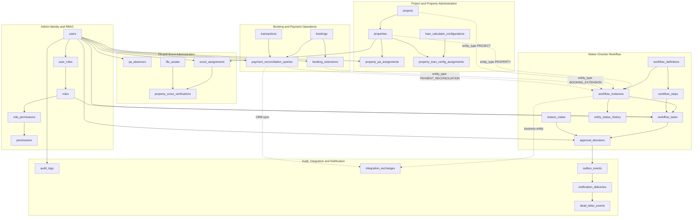

---

## 3. Admin RBAC ER diagram

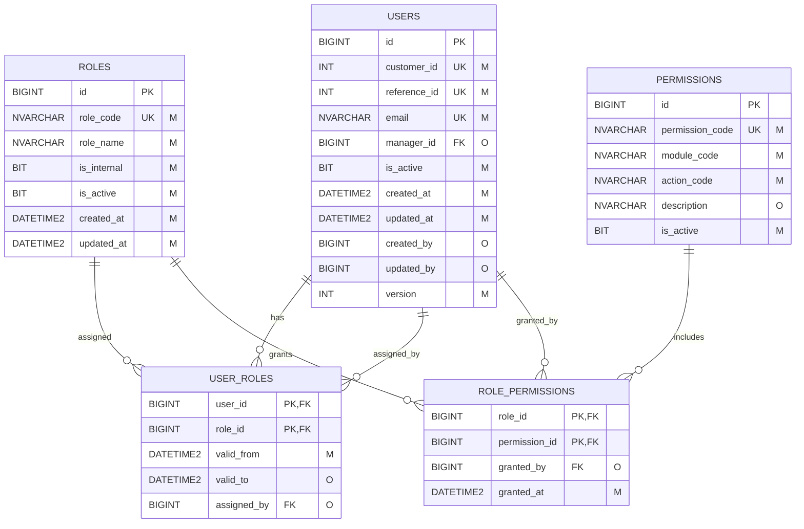

### Initial Admin role catalogue

- `SYSTEM_ADMIN`
- `ADMIN_CONTENT_MANAGER`
- `ADMIN_OPERATIONS_MAKER`
- `ADMIN_OPERATIONS_CHECKER`
- `LEGAL_OFFICER`
- `CUSTOMER_SERVICE_AGENT`
- `PA_MANAGER_INTERNAL`
- `PA_MANAGER_EXTERNAL`
- `INTERNAL_PA`
- `EXTERNAL_PA`
- `PROPERTY_SCOUT`

Roles remain configurable records; they should not be hard-coded as a single `users.role` value.

---

## 4. Projects, properties, PA assignments and loan configuration

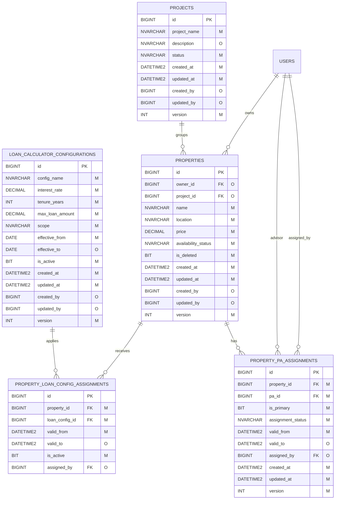

### Why `property_loan_config_assignments` is used

The supplied master blueprint places `loan_config_id` directly on `properties`, but also supports `ALL` and `SELECTED_PROPERTIES` scopes with future configuration changes. A versioned assignment table avoids mass-updating every property and preserves which configuration was effective at a given time.

For a global configuration, the application resolves the active `scope = ALL` record unless a property-specific active assignment overrides it.

---

## 5. PA absence and Scout verification ER diagram

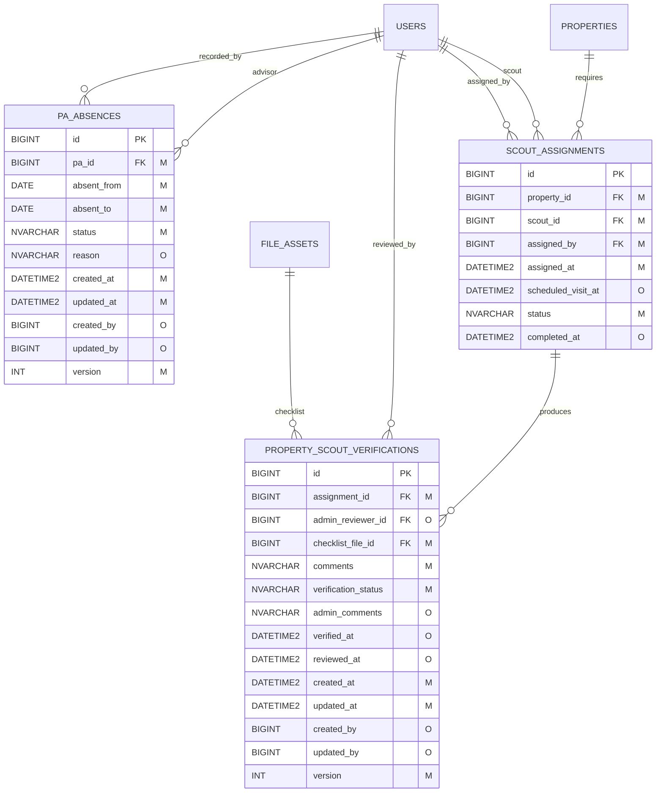

### PA availability flow

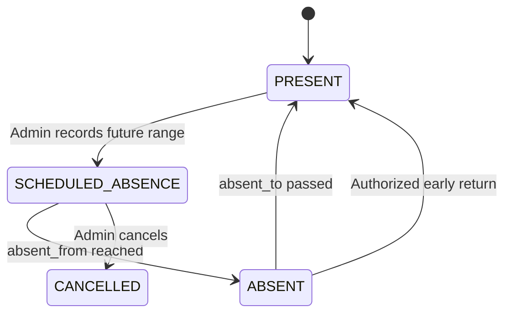

Do not use `pa_absences.status` as the only source of truth for the user's account. Account activation and availability are separate concepts. `users.is_active` controls account access; the current date and active absence rows determine routing availability.

---

## 6. Generic Admin maker-checker ER diagram

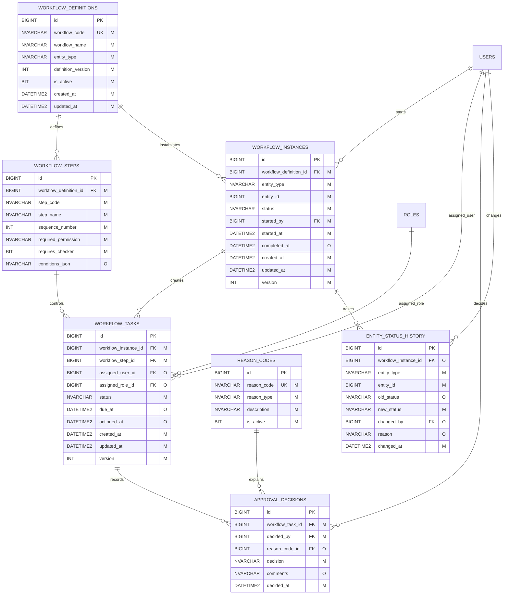

### Maker-checker execution flow

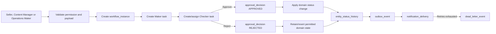

### Recommended workflow definitions

| Workflow code | Entity type | Typical actors |
|---|---|---|
| `PROPERTY_PUBLISH` | `PROPERTY` | Content Manager → Operations Checker |
| `PROPERTY_UNPUBLISH` | `PROPERTY` | Content Manager/Seller → Operations Checker |
| `PROPERTY_DELIST` | `PROPERTY` | Authorized Maker → Operations Checker |
| `PROJECT_PUBLISH` | `PROJECT` | Content Manager → Operations Checker |
| `SCOUT_VERIFICATION_REVIEW` | `SCOUT_VERIFICATION` | Scout → Admin Reviewer |
| `BOOKING_EXTENSION` | `BOOKING_EXTENSION` | Buyer/PA → Operations Maker or Checker |
| `PAYMENT_RECONCILIATION` | `PAYMENT_RECONCILIATION` | Customer/CS Agent → Finance/Operations |
| `LOAN_CONFIG_CHANGE` | `LOAN_CONFIGURATION` | Admin Maker → Admin Checker |
| `PA_ASSIGNMENT_CHANGE` | `PROPERTY_PA_ASSIGNMENT` | PA Manager/Admin → Checker when required |

---

## 7. Booking extension and payment reconciliation ER diagram

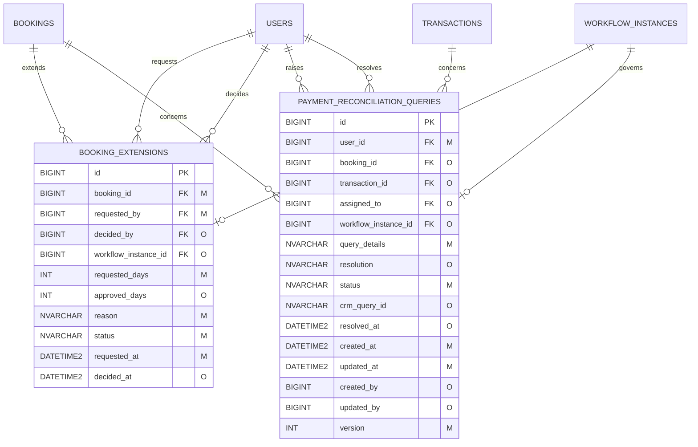

### Booking-extension rule requiring confirmation

The earlier customer/business baseline specifies **1–2 calendar days**, requested on Day 4 or Day 5. The supplied Admin v24 blueprint specifies **exactly 7 additional days**. These requirements conflict.

Until the Product Owner confirms the final rule:

- Keep `requested_days` and `approved_days` configurable.
- Do not hard-code `7` in Java or the database default.
- Store the allowed values in `system_configurations` or workflow rules.
- Keep the property `RESERVED` while an extension decision is pending.

---

## 8. Admin workflow state diagrams

### Project publication

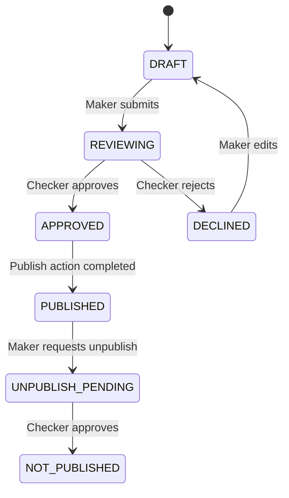

### Property publication

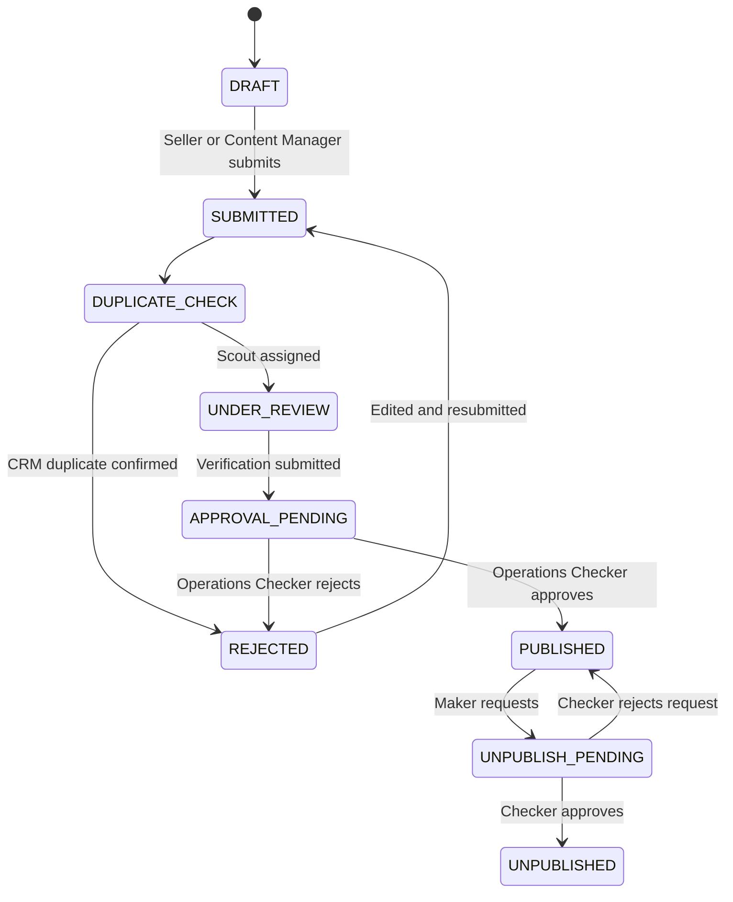

### Payment reconciliation

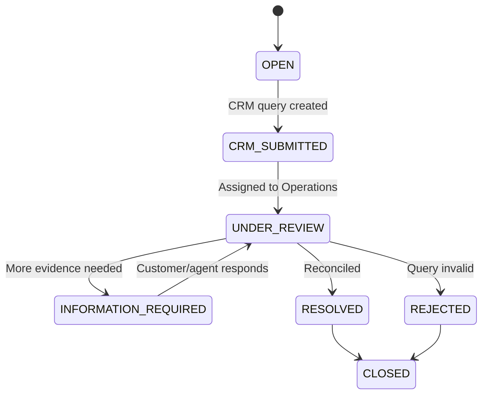

---

## 9. Admin integration, audit and notification mapping

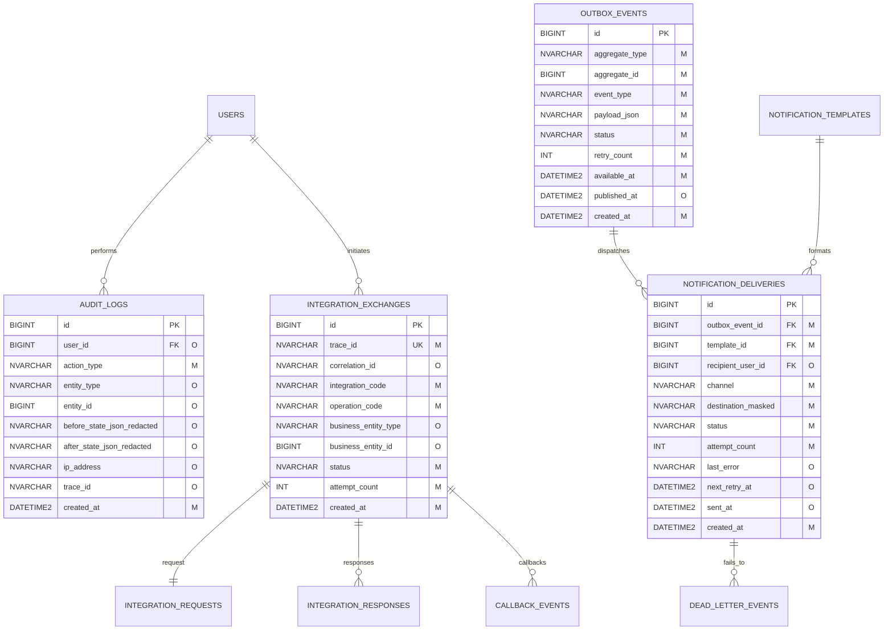

Admin actions that require audit events include role changes, PA assignments, absence changes, project/property publication, checker decisions, booking-extension decisions, loan configuration changes, reconciliation resolution, manual KYC review, and dead-letter replay.

---

## 10. Mandatory constraints and indexes

1. `property_pa_assignments`: filtered unique index on `(property_id, pa_id)` where status is `ACTIVE`.
2. `property_pa_assignments`: filtered unique index on `property_id` where `is_primary = 1` and status is `ACTIVE`.
3. `pa_absences`: check `absent_to >= absent_from`; reject overlapping active ranges for the same PA in application logic or a transaction-safe procedure.
4. `workflow_steps`: unique `(workflow_definition_id, step_code)` and `(workflow_definition_id, sequence_number)`.
5. `workflow_instances`: index `(entity_type, entity_id, status)`.
6. `workflow_tasks`: index `(assigned_user_id, status, due_at)` and `(assigned_role_id, status, due_at)`.
7. `approval_decisions`: index `(workflow_task_id, decided_at)`.
8. `entity_status_history`: index `(entity_type, entity_id, changed_at DESC)`.
9. `booking_extensions`: filtered unique index allowing only one `PENDING` extension per booking.
10. `payment_reconciliation_queries`: index `(status, assigned_to, created_at)` and `(transaction_id)`.
11. `loan_calculator_configurations`: prevent overlapping effective global configurations.
12. `property_loan_config_assignments`: prevent overlapping active configurations per property.
13. `file_assets`: unique `storage_key` and index `checksum_sha256`.
14. All Admin decisions must run with optimistic version checks; property reservation/payment paths additionally use pessimistic locking.

---

## 11. Audit and temporal standard

Mutable Admin tables must include:

| Field | SQL Server type | Rule |
|---|---|---|
| `created_at` | `DATETIME2` | UTC, `NOT NULL` |
| `updated_at` | `DATETIME2` | UTC, `NOT NULL` |
| `created_by` | `BIGINT` | User FK; nullable only for system/migration |
| `updated_by` | `BIGINT` | User FK; nullable only for system operations |
| `version` | `INT` | Optimistic lock, `NOT NULL` |

Recommended temporal tables:

- `users`
- `projects`
- `properties`
- `property_pa_assignments`
- `pa_absences`
- `loan_calculator_configurations`
- `property_loan_config_assignments`
- `bookings`
- `booking_extensions`
- `workflow_instances`
- `workflow_tasks`
- `payment_reconciliation_queries`

Append-only ledgers such as `approval_decisions`, `entity_status_history`, `audit_logs`, integration requests/responses, and outbox events should not be rewritten except for explicit processing-state fields.

---

## 12. Future Admin FSD update method

1. Add new actors through `roles`, `permissions`, and their junction tables.
2. Version workflow definitions instead of altering historical workflow instances.
3. Reuse `workflow_instances`, `workflow_tasks`, and `approval_decisions` for new maker-checker processes.
4. Add controlled rejection/approval reasons to `reason_codes`.
5. Record domain transitions in `entity_status_history`.
6. Publish post-commit integration and notification work through `outbox_events`.
7. Update this document and create a versioned Flyway migration for every approved schema change.
