# HFCB Marketplace — Graphical Database Mapping Baseline

**Version:** 5.2 — normalized, extensible baseline  
**Database:** Microsoft SQL Server  
**Application:** Java Spring Boot 3.x  
**Status:** Recommended source of truth for implementation and future Admin FSD revisions

> This replaces the earlier v4 mapping. It preserves normalized business relationships, the many-to-many Property–PA assignment, one accountable PA per inquiry, saved request/response data, Admin maker-checker workflows, auditing, and future extension points.

## 1. Design decision

Use the normalized relational model as the transactional source of truth. Do not merge relationships, messages, approvals, KYC cases, or user activity into JSON arrays.

JSON remains appropriate only for redacted integration payloads, audit snapshots, provider metadata, template variables, and flexible configuration.

### Legend

- `PK`: primary key
- `FK`: foreign key
- `UK`: unique key
- `M`: mandatory / `NOT NULL`
- `O`: optional / nullable
- Mutable tables carry `created_at`, `updated_at`, `created_by`, `updated_by`, and `version`.
- Important transactional tables also use SQL Server temporal fields `SysStartTime` and `SysEndTime`.

---

## 2. Complete graphical system map

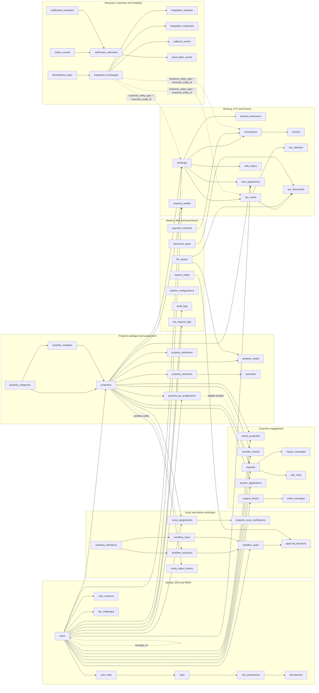

---

## 3. Identity, SSO and RBAC tables

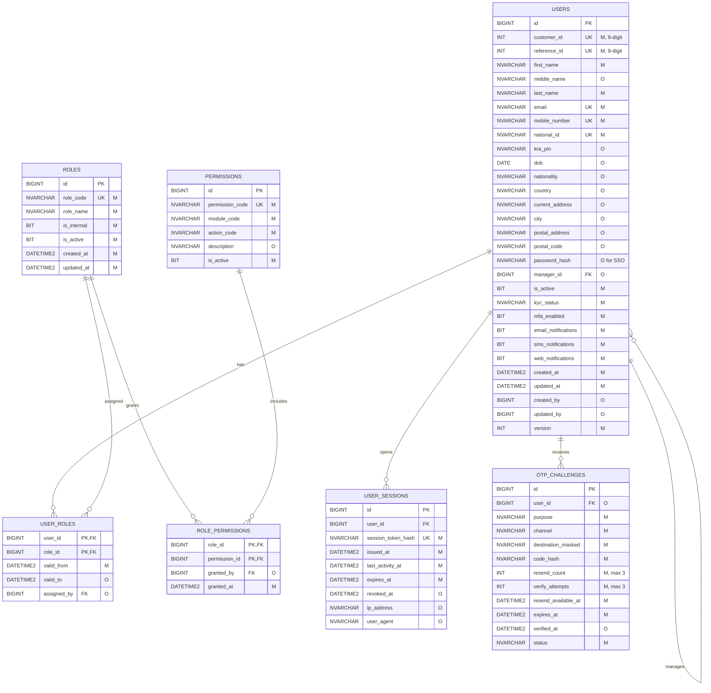

---

## 4. Property, PA assignment and catalogue tables

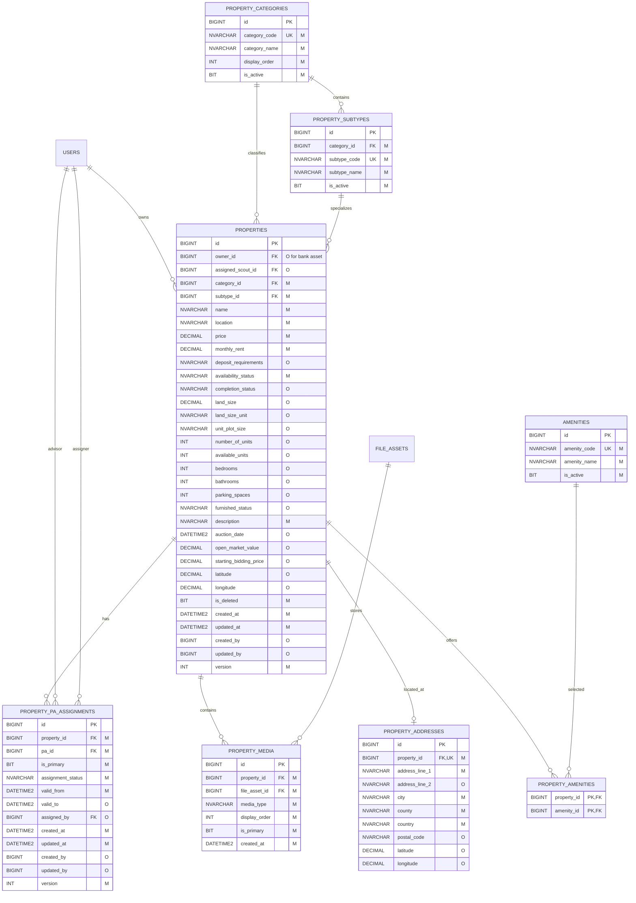

**Assignment constraints**

- One property can have many active PAs and one PA can manage many properties.
- Only one active assignment per `(property_id, pa_id)`.
- Only one active `is_primary = 1` assignment per property.
- `inquiries.assigned_pa_id` remains one PA per inquiry for SLA ownership.

---

## 5. Scout verification and Admin workflow tables

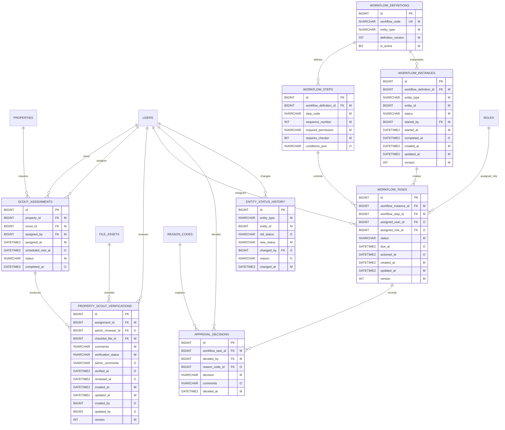

---

## 6. Engagement, inquiry and support tables

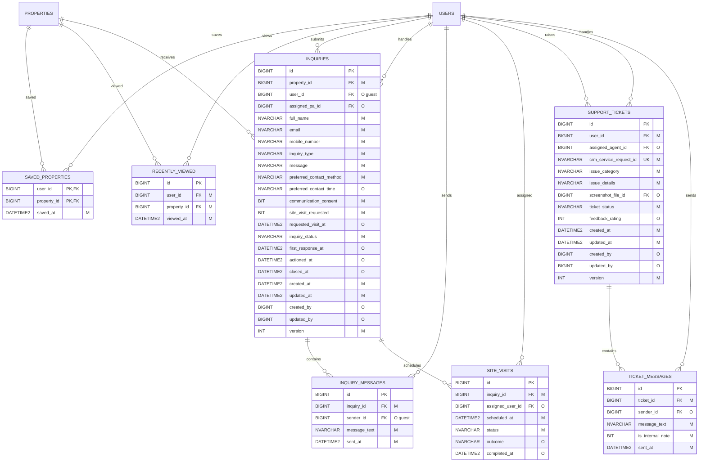

---

## 7. Booking, payment, KYC, loan and auction tables

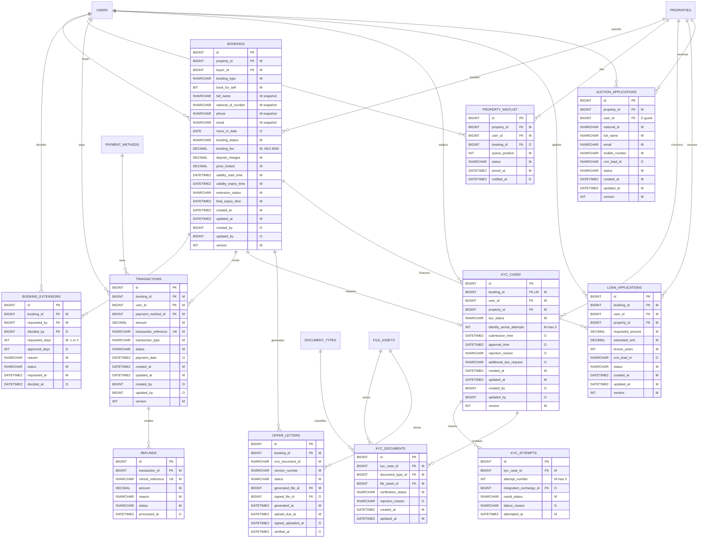

---

## 8. Saved request, response, callback and notification tables

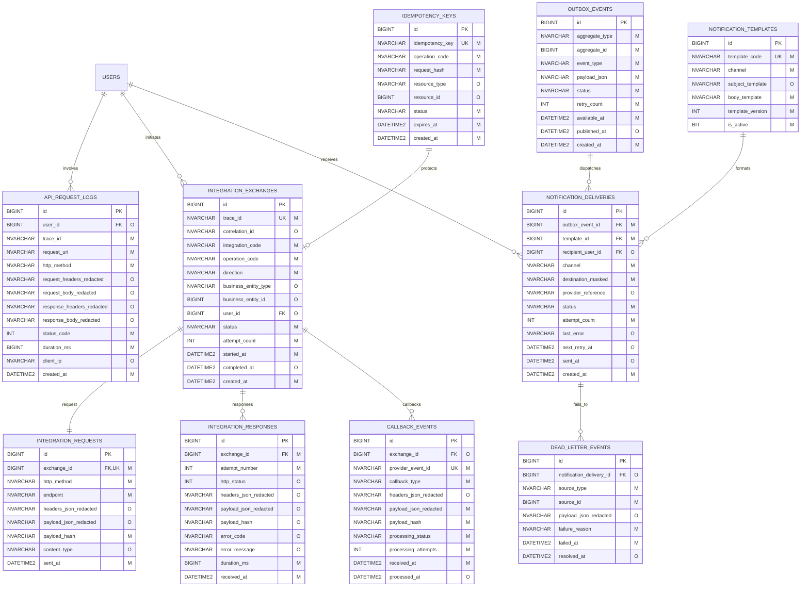

### Integration usage

- `api_request_logs`: inbound Marketplace HTTP diagnostics.
- `integration_exchanges`: parent correlation for CRM, Core Banking, IdentitySense, M-Pesa, Boma Yangu, email, and SMS.
- `integration_requests`: one outbound request per exchange.
- `integration_responses`: all response/retry attempts.
- `callback_events`: asynchronous provider notifications with duplicate protection.
- `idempotency_keys`: client and provider operation deduplication.
- `outbox_events`: reliable post-commit dispatch.
- `notification_deliveries`: recipient/channel retries.
- `dead_letter_events`: exhausted failures requiring support action.

---

## 9. Master, file and audit tables

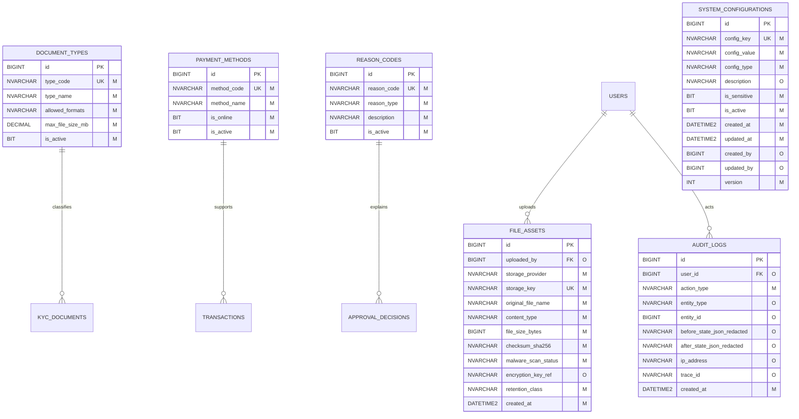

---

## 10. Core workflow graphics

### Property listing and approval

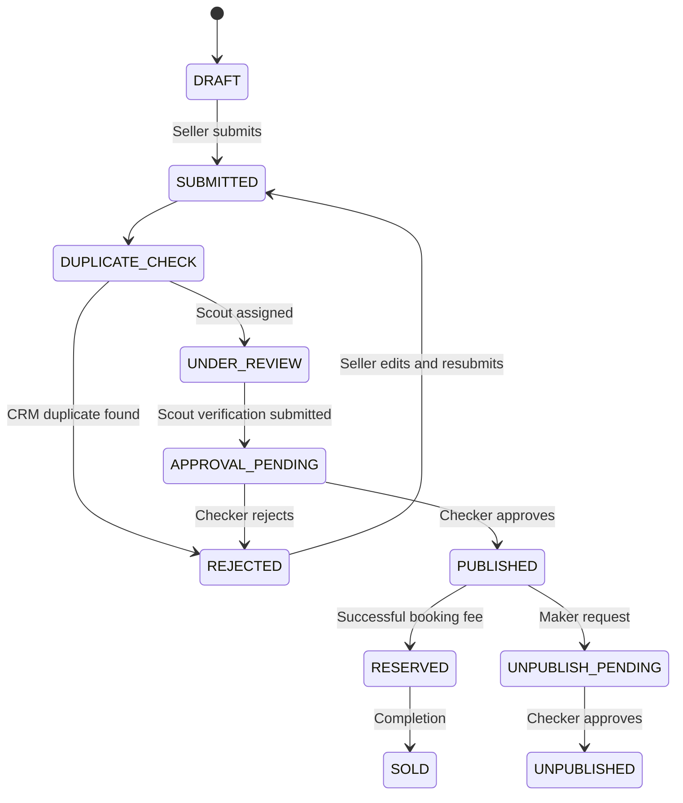

### Booking and payment

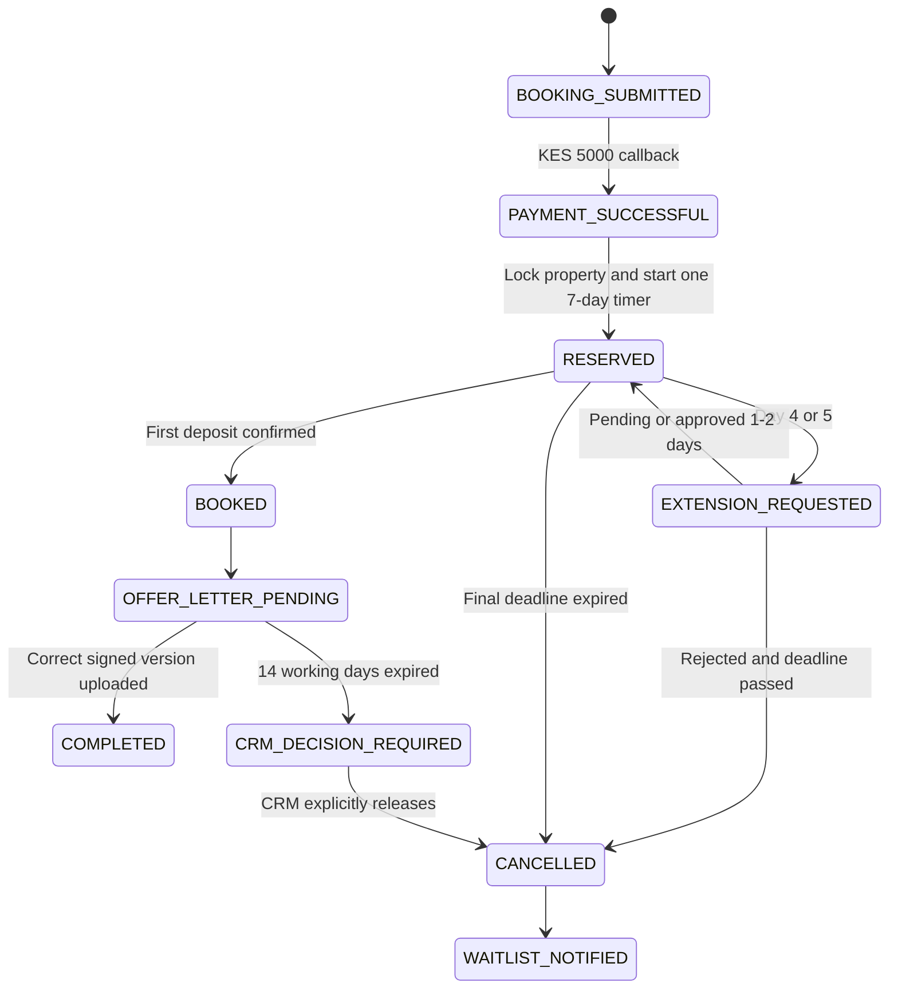

### KYC

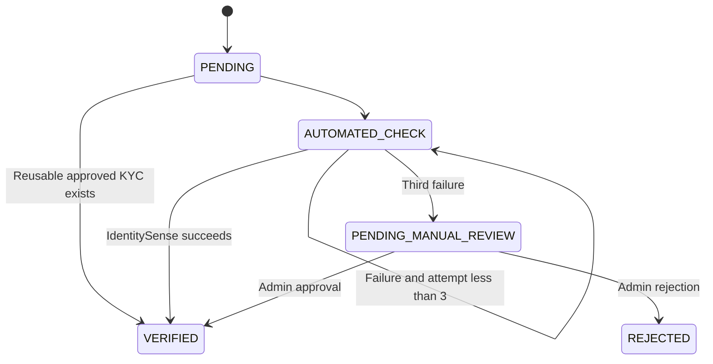

### Admin maker-checker

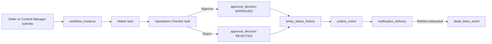

---

## 11. Mandatory audit and temporal standard

Apply to mutable business, master, assignment, and workflow tables:

| Field | MSSQL type | Rule |
|---|---|---|
| `created_at` | `DATETIME2` | `NOT NULL`, UTC default |
| `updated_at` | `DATETIME2` | `NOT NULL`, updated on every change |
| `created_by` | `BIGINT` | User FK; nullable only for migration/system action |
| `updated_by` | `BIGINT` | User FK; nullable only for system action |
| `version` | `INT` | `NOT NULL`, optimistic lock |

Use system versioning for `users`, `properties`, `property_pa_assignments`, `bookings`, `transactions`, `kyc_cases`, `workflow_instances`, and `workflow_tasks`.

Append-only logs should not be modified except for explicit processing fields. Store business transition reasons in `entity_status_history`; temporal history alone does not identify the business reason adequately.

---

## 12. Simplified-model comparison

The eight-table simplified design must not be the production transactional model.

| Simplified approach | Recommended relational structure |
|---|---|
| `users.saved_property_ids` JSON | `saved_properties` |
| `users.recently_viewed_ids` JSON | `recently_viewed` |
| `properties.assigned_pa_ids` JSON | `property_pa_assignments` |
| Scout columns in `properties` | `scout_assignments`, `property_scout_verifications` |
| Approval columns in `properties` | `workflow_instances`, `workflow_tasks`, `approval_decisions` |
| Mortgage JSON in `bookings` | `loan_applications` |
| Auction as booking subtype | `auction_applications` |
| User-level KYC attempt count only | `kyc_cases`, `kyc_attempts` |
| Inquiry chat JSON | `inquiry_messages` |
| Support as inquiry subtype | `support_tickets`, `ticket_messages` |
| One `system_logs` table | Purpose-specific audit, API, integration, callback, and retry tables |

The simplified representation may be used as a reporting view, cache, search document, or API response projection.

---

## 13. Security and retention

1. Never persist passwords, OTP values, access tokens, refresh tokens, session tokens, authorization headers, CVV, or card data in plaintext.
2. Redact or encrypt National ID, KRA PIN, contact details, bank accounts, document URLs, and integration payload fields.
3. Store binaries in encrypted object storage and retain only metadata/storage keys in `file_assets`.
4. Apply separate retention policies to API logs, integration payloads, callbacks, audit events, notifications, and uploaded documents.
5. Partition high-volume tables by date and archive/purge them according to compliance rules.
6. Restrict request/response data using dedicated support and audit permissions.
7. Use hashes for duplicate detection and forensic integrity.

---

## 14. Future update strategy

When a new Admin FSD arrives:

1. Map each actor to `roles` and `permissions`.
2. Add or version `workflow_definitions` and `workflow_steps` rather than adding approval columns to domain tables.
3. Reuse `workflow_instances`, `workflow_tasks`, and `approval_decisions`.
4. Add reason values to `reason_codes`.
5. Record every business status transition in `entity_status_history`.
6. Publish notifications/integrations through `outbox_events`.
7. Add a migration and increment this baseline version.
