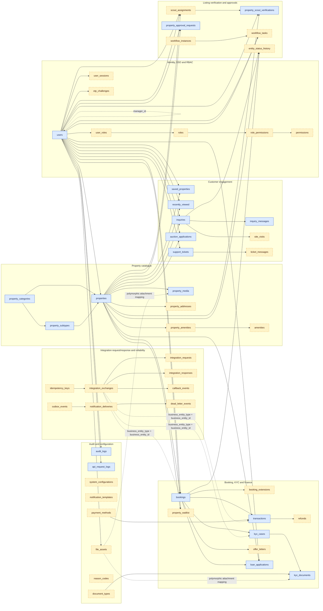
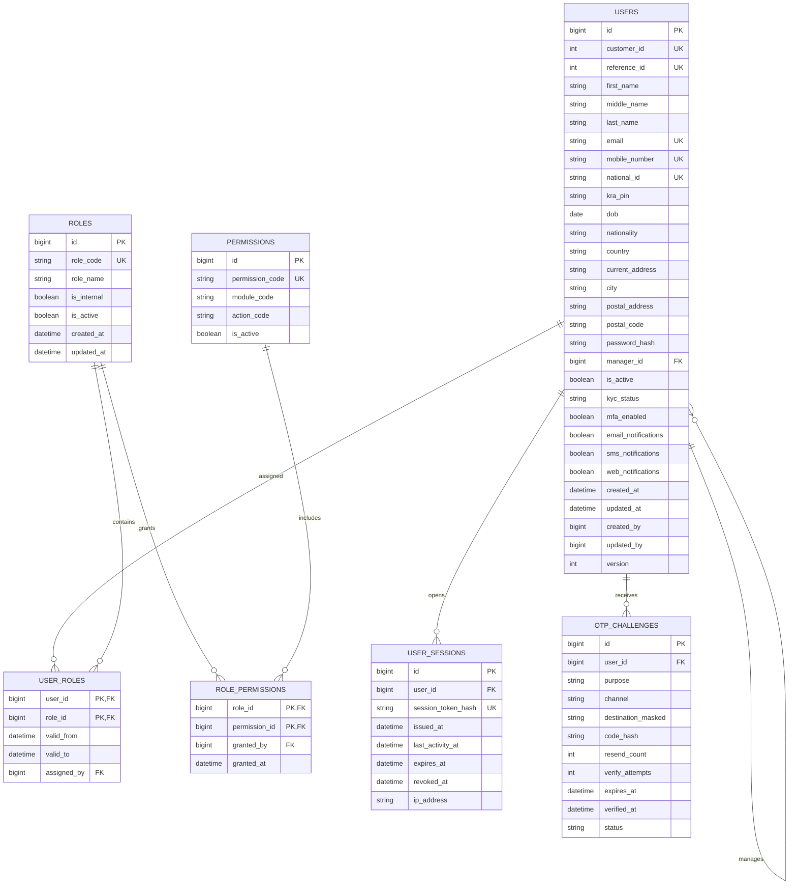
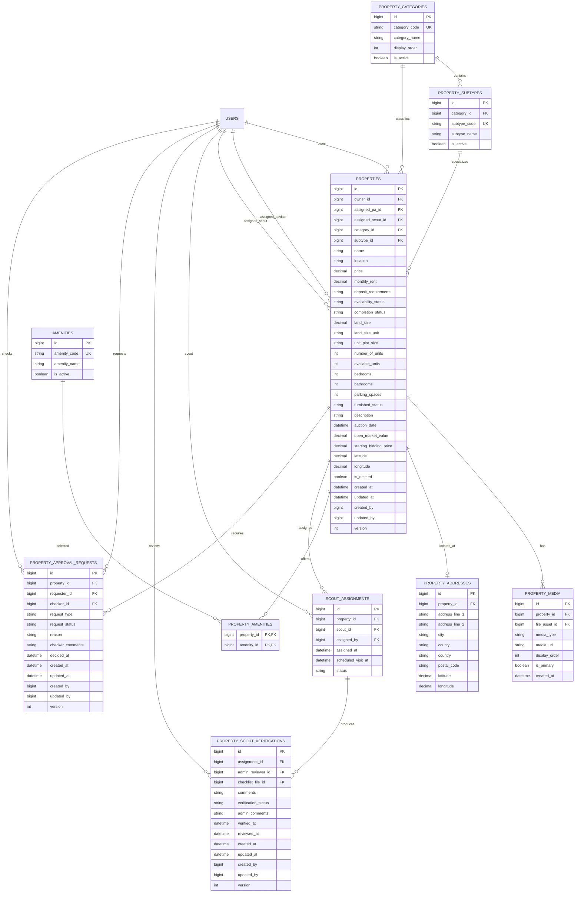
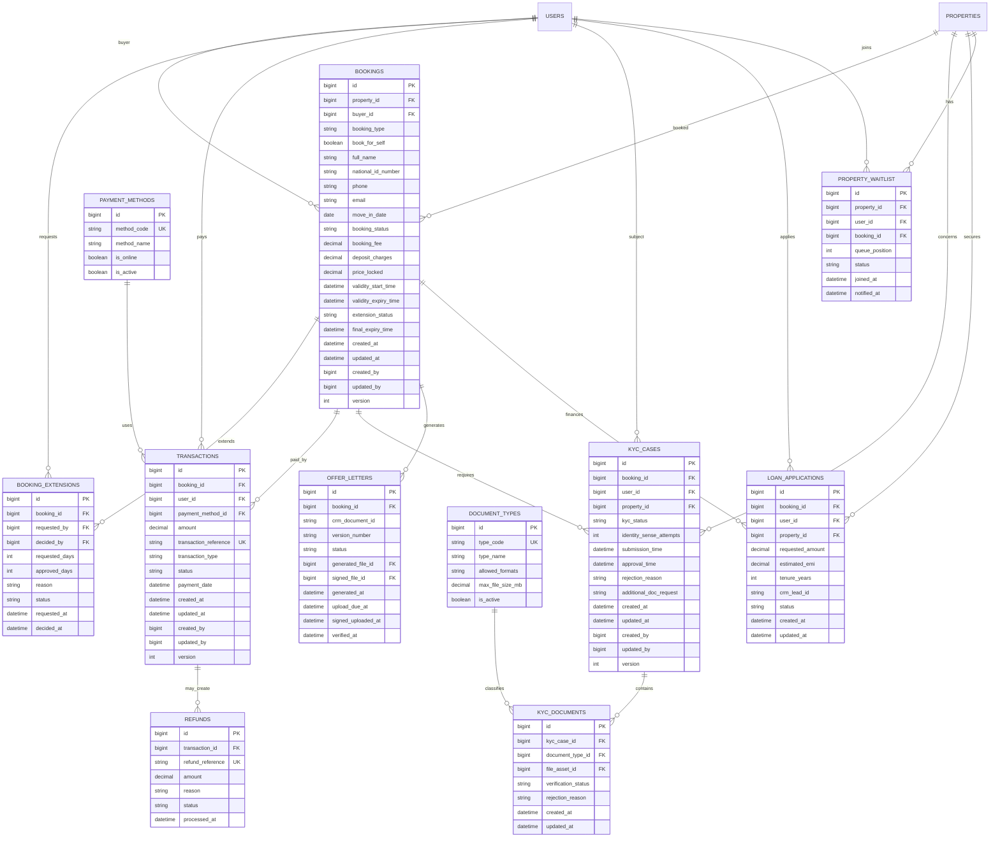
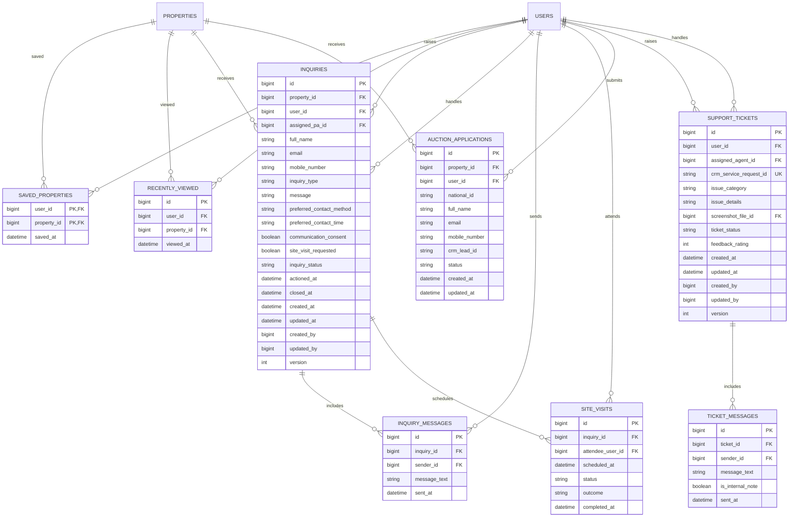
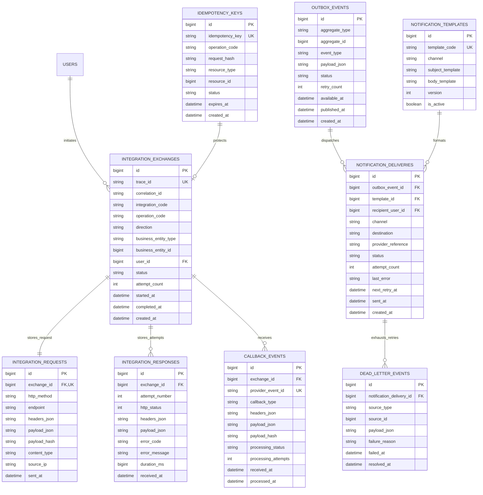
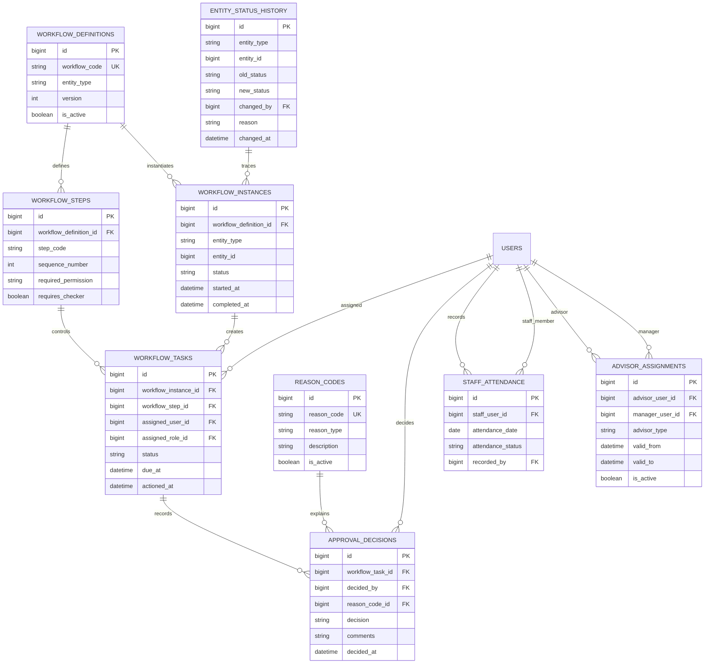

# HFCB Marketplace — Graphical Database Mapping Baseline

**Version:** 4.0 (extensible baseline)  
**Database:** Microsoft SQL Server  
**Purpose:** Graphical relationship map for the current marketplace scope, saved API request/response data, and anticipated Admin workflows.

> This document is deliberately modular. Future Admin FSD changes can be added to the Administration and Workflow modules without redesigning the customer, property, booking, or payment cores.

## Legend

- **Current core**: required by the supplied marketplace/FSD baseline.
- **Future-ready**: recommended extension point; finalize fields and rules after the relevant Admin FSD is approved.
- `PK` = primary key, `FK` = foreign key, `UK` = unique key.
- Every mutable business table should include `created_at`, `updated_at`, `created_by`, `updated_by`, and `version`.
- Append-only logs/events should normally use `created_at` only and must not be edited.

## 1. Complete system relationship map

## 2. Core identity and access mapping

> Future recommendation: avoid keeping a single `users.role` column as the long-term authorization source. Keep it temporarily for compatibility, but use `user_roles`, `roles`, and `role_permissions` for Admin RBAC.

## 3. Property catalogue and verification mapping

## 4. Booking, payment, KYC and offer mapping

## 5. Inquiry, auction, support and engagement mapping

## 6. Saved request and response mapping

Use separate exchange, request, response, and callback tables. This is safer and more extensible than adding every integration payload directly to `api_request_logs`.

### Request/response storage rules

1. `api_request_logs` is for inbound Marketplace REST diagnostics.
2. `integration_exchanges` is the parent record for outbound/inbound external-system calls such as CRM, IdentitySense, M-Pesa, Core Banking, Boma Yangu, Email, and SMS.
3. Store one request in `integration_requests` and all retries/responses in `integration_responses`.
4. Store asynchronous provider callbacks in `callback_events`; use `provider_event_id` and `payload_hash` to reject duplicates.
5. Mask or encrypt National IDs, tokens, passwords, OTPs, card details, bank statements, and authorization headers. Do not save secrets as plain JSON.
6. Add retention and purge policies. Request/response logs should not be retained forever merely because they are useful for debugging.

## 7. Future Admin workflow extension map

These are extension points, not final Admin schema decisions.

## 8. Mandatory auditing standard

Apply this to every mutable business/master/workflow table:

| Column | MSSQL type | Null | Rule |
|---|---|---:|---|
| `created_at` | `DATETIME2` | No | Default `SYSUTCDATETIME()` |
| `updated_at` | `DATETIME2` | No | Set by application on every update |
| `created_by` | `BIGINT` | Yes | FK to `users.id`; null only for system/migration records |
| `updated_by` | `BIGINT` | Yes | FK to `users.id`; null only for system jobs |
| `version` | `INT` | No | Optimistic lock, default `1` |
| `is_active` | `BIT` | Conditional | Use for configurable master records |

For temporal transactional tables, additionally use `SysStartTime`, `SysEndTime`, and `SYSTEM_VERSIONING`. For append-only logs, do not add `updated_at` unless records genuinely transition through processing states.

## 9. Recommended boundary decisions

- Keep file binary content outside MSSQL; store metadata in `file_assets` and encrypted object-storage URLs.
- Replace free-text role, category, subtype, document type, payment method, and reason values with foreign keys to master tables.
- Keep status history in `entity_status_history`; temporal history alone does not capture business reason or acting user clearly.
- Use `workflow_*` tables for future maker-checker/admin approvals instead of adding more approval columns to every domain table.
- Use the transactional outbox pattern so notification failures never roll back bookings, payments, KYC, approvals, or property state.
- Partition or archive high-volume `api_request_logs`, `integration_responses`, `audit_logs`, and `recently_viewed` records by date.
- Treat this as schema baseline **v4.0**. Future Admin FSD updates should increment the version and include a migration/change log.
