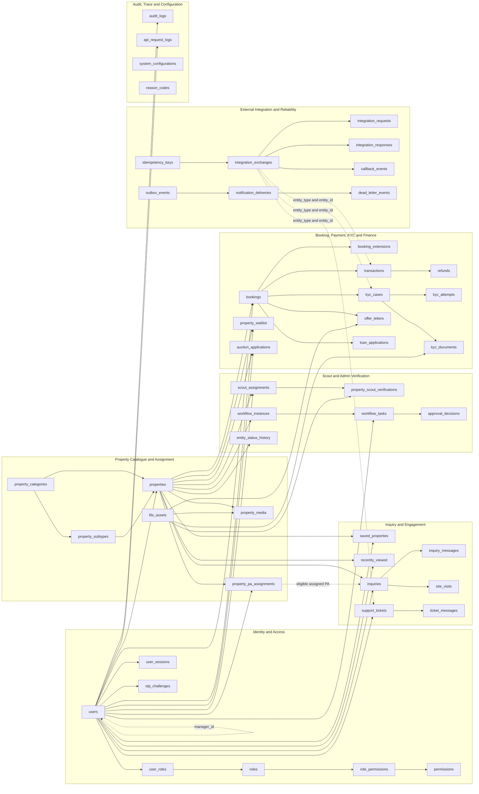
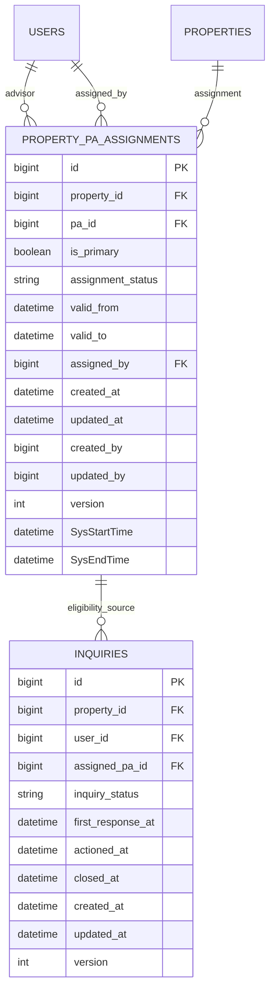
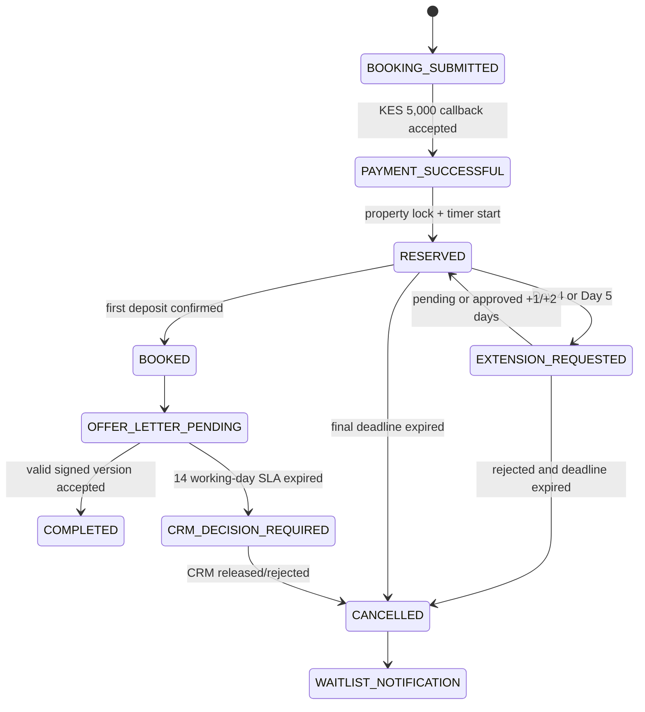
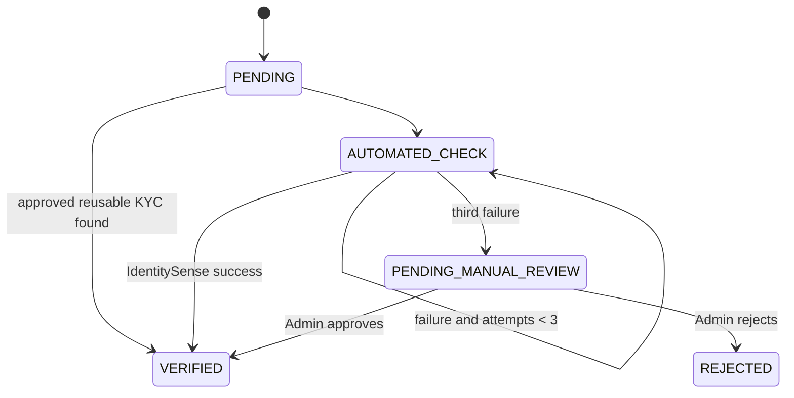
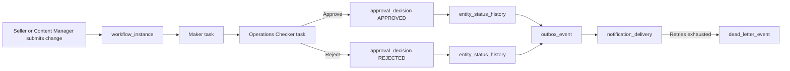
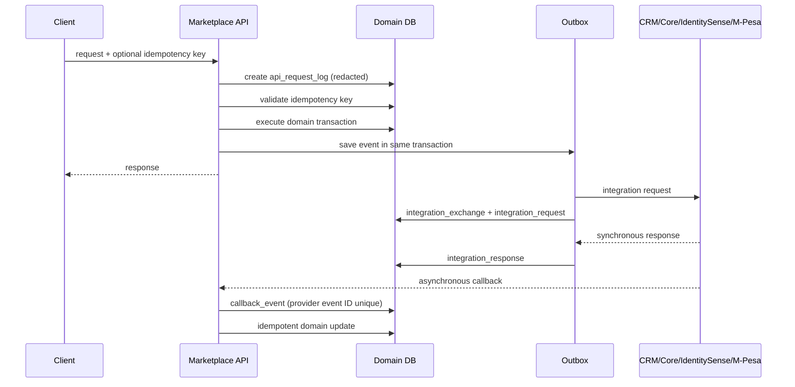

# HFCB Property Marketplace — Recommended ER & Workflow Baseline v5.1

**Compared inputs**

1. `hfcb-marketplace-comprehensive-ai-blueprint-v4.md` — normalized 19-table model with many-to-many PA assignments.
2. `hfcb-marketplace-simplified-db-blueprint.md` — consolidated 8-table JSON-heavy model.

**Target:** Java Spring Boot 3.x + Microsoft SQL Server  
**Status:** Recommended baseline for customer, property, Admin, integration, audit, and future FSD changes.

---

## 1. Decision

Use the **normalized v4 model as the foundation**, enhanced with the integration, workflow, RBAC, status-history, notification, and file-asset tables from the previous future-ready design.

Do **not** use the simplified eight-table model as the production source of truth. Its JSON consolidation is suitable for read models, caches, search indexes, snapshots, or prototypes, but not for primary transactional data.

### Why the normalized model is recommended

| Area | Normalized v4 | Simplified 8-table | Decision |
|---|---|---|---|
| Property-to-PA assignment | Junction table with FK integrity, primary PA, assignment history | PA IDs in JSON | Use `property_pa_assignments` |
| Saved/recent properties | Queryable relational records | Arrays inside `users` | Keep relational tables |
| Inquiry messages | Append-only message rows | Rewrites one JSON array | Keep `inquiry_messages` |
| KYC attempts/cases | Transaction-specific case history | Global fields on `users` | Keep `kyc_cases` + attempt history |
| Admin approvals | Multiple requests and decisions | Current approval columns on property | Keep workflow/approval tables |
| Scout verification | Repeatable assignments and reviews | One set of property columns | Keep separate verification tables |
| Loans and auction EOI | Different lifecycle and CRM rules | Polymorphic booking row | Keep separate tables |
| Audit and API traces | Separate purpose/retention/security boundaries | One large `system_logs` table | Keep separate ledgers |
| External requests/responses | Dedicated retry/callback design | Generic JSON log | Keep integration exchange tables |
| Future Admin FSD changes | Extensible | Requires repeated JSON/schema logic changes | Normalized workflow model |

### Safe uses of JSON

Use JSON only for data that is naturally variable and does not replace a business relationship:

- Redacted request/response bodies.
- Audit before/after snapshots.
- Provider-specific metadata.
- Workflow configuration conditions.
- Notification template variables.
- Non-queryable property metadata extensions.

Do not store PA IDs, property IDs, messages, KYC cases, payments, approvals, or wishlists as JSON arrays.

---

## 2. Module-level graphical map

---

## 3. Complete logical ER diagram

```mermaid
erDiagram
  USERS ||--o{ USERS : manages
  USERS ||--o{ USER_ROLES : has
  ROLES ||--o{ USER_ROLES : assigned
  ROLES ||--o{ ROLE_PERMISSIONS : grants
  PERMISSIONS ||--o{ ROLE_PERMISSIONS : includes
  USERS ||--o{ USER_SESSIONS : opens
  USERS ||--o{ OTP_CHALLENGES : receives

  USERS ||--o{ PROPERTIES : owns
  PROPERTY_CATEGORIES ||--o{ PROPERTY_SUBTYPES : contains
  PROPERTY_CATEGORIES ||--o{ PROPERTIES : classifies
  PROPERTY_SUBTYPES ||--o{ PROPERTIES : specializes
  PROPERTIES ||--o{ PROPERTY_PA_ASSIGNMENTS : managed_by
  USERS ||--o{ PROPERTY_PA_ASSIGNMENTS : manages
  USERS ||--o{ PROPERTY_PA_ASSIGNMENTS : assigns
  PROPERTIES ||--o{ PROPERTY_MEDIA : contains
  FILE_ASSETS ||--o{ PROPERTY_MEDIA : stores

  PROPERTIES ||--o{ SCOUT_ASSIGNMENTS : requires
  USERS ||--o{ SCOUT_ASSIGNMENTS : assigned_scout
  SCOUT_ASSIGNMENTS ||--o{ PROPERTY_SCOUT_VERIFICATIONS : produces
  USERS ||--o{ PROPERTY_SCOUT_VERIFICATIONS : reviews
  FILE_ASSETS ||--o{ PROPERTY_SCOUT_VERIFICATIONS : checklist

  USERS ||--o{ SAVED_PROPERTIES : saves
  PROPERTIES ||--o{ SAVED_PROPERTIES : saved
  USERS ||--o{ RECENTLY_VIEWED : views
  PROPERTIES ||--o{ RECENTLY_VIEWED : viewed
  USERS ||--o{ INQUIRIES : submits
  USERS ||--o{ INQUIRIES : owns_as_PA
  PROPERTIES ||--o{ INQUIRIES : receives
  INQUIRIES ||--o{ INQUIRY_MESSAGES : contains
  USERS ||--o{ INQUIRY_MESSAGES : sends
  INQUIRIES ||--o{ SITE_VISITS : schedules
  USERS ||--o{ SITE_VISITS : assigned

  USERS ||--o{ BOOKINGS : creates
  PROPERTIES ||--o{ BOOKINGS : receives
  BOOKINGS ||--o{ BOOKING_EXTENSIONS : requests
  USERS ||--o{ BOOKING_EXTENSIONS : decides
  PROPERTIES ||--o{ PROPERTY_WAITLIST : has
  USERS ||--o{ PROPERTY_WAITLIST : joins
  BOOKINGS ||--o{ TRANSACTIONS : funds
  USERS ||--o{ TRANSACTIONS : pays
  PAYMENT_METHODS ||--o{ TRANSACTIONS : uses
  TRANSACTIONS ||--o{ REFUNDS : refunded_by

  BOOKINGS ||--o| KYC_CASES : requires
  USERS ||--o{ KYC_CASES : subject
  PROPERTIES ||--o{ KYC_CASES : concerns
  KYC_CASES ||--o{ KYC_ATTEMPTS : checks
  KYC_CASES ||--o{ KYC_DOCUMENTS : contains
  DOCUMENT_TYPES ||--o{ KYC_DOCUMENTS : classifies
  FILE_ASSETS ||--o{ KYC_DOCUMENTS : stores

  BOOKINGS ||--o{ OFFER_LETTERS : generates
  FILE_ASSETS ||--o{ OFFER_LETTERS : stores
  BOOKINGS ||--o{ LOAN_APPLICATIONS : finances
  USERS ||--o{ LOAN_APPLICATIONS : applies
  PROPERTIES ||--o{ LOAN_APPLICATIONS : secures
  PROPERTIES ||--o{ AUCTION_APPLICATIONS : receives
  USERS ||--o{ AUCTION_APPLICATIONS : submits

  USERS ||--o{ SUPPORT_TICKETS : raises
  USERS ||--o{ SUPPORT_TICKETS : handles
  SUPPORT_TICKETS ||--o{ TICKET_MESSAGES : contains
  USERS ||--o{ TICKET_MESSAGES : sends

  WORKFLOW_DEFINITIONS ||--o{ WORKFLOW_STEPS : defines
  WORKFLOW_DEFINITIONS ||--o{ WORKFLOW_INSTANCES : instantiates
  WORKFLOW_INSTANCES ||--o{ WORKFLOW_TASKS : creates
  WORKFLOW_STEPS ||--o{ WORKFLOW_TASKS : controls
  USERS ||--o{ WORKFLOW_TASKS : assigned
  WORKFLOW_TASKS ||--o{ APPROVAL_DECISIONS : records
  USERS ||--o{ APPROVAL_DECISIONS : decides
  REASON_CODES ||--o{ APPROVAL_DECISIONS : explains

  USERS ||--o{ ENTITY_STATUS_HISTORY : changes
  USERS ||--o{ AUDIT_LOGS : performs
  USERS ||--o{ API_REQUEST_LOGS : invokes

  USERS ||--o{ INTEGRATION_EXCHANGES : initiates
  INTEGRATION_EXCHANGES ||--|| INTEGRATION_REQUESTS : request
  INTEGRATION_EXCHANGES ||--o{ INTEGRATION_RESPONSES : responses
  INTEGRATION_EXCHANGES ||--o{ CALLBACK_EVENTS : callbacks
  IDEMPOTENCY_KEYS ||--o| INTEGRATION_EXCHANGES : protects
  OUTBOX_EVENTS ||--o{ NOTIFICATION_DELIVERIES : dispatches
  NOTIFICATION_TEMPLATES ||--o{ NOTIFICATION_DELIVERIES : formats
  NOTIFICATION_DELIVERIES ||--o{ DEAD_LETTER_EVENTS : fails_to
```

---

## 4. Critical table details and cardinality rules

### 4.1 Property-to-PA assignment

Rules:

1. `UNIQUE(property_id, pa_id, assignment_status)` or an equivalent filtered unique index prevents duplicate active assignments.
2. A filtered unique index on `property_id WHERE is_primary = 1 AND assignment_status = 'ACTIVE'` permits only one active Primary PA per property.
3. `inquiries.assigned_pa_id` remains many-to-one for accountability.
4. At assignment time, the selected inquiry PA must be an active PA assignment for that property, except an authorized manager fallback.
5. Do not delete assignment history; close it using `valid_to` and `assignment_status`, with temporal history enabled.

### 4.2 Booking and payment flow

Storage mapping:

- `bookings`: current state, locked price, timer values.
- `booking_extensions`: every request and decision.
- `transactions`: payment ledger and unique provider references.
- `idempotency_keys` and `callback_events`: duplicate callback protection.
- `property_waitlist`: ordered waitlist and notification status.
- `offer_letters`: every generated document version and upload deadline.
- `entity_status_history`: reasoned property and booking transitions.

### 4.3 KYC flow

Use `kyc_attempts` for individual IdentitySense calls. A single `identity_sense_attempts` counter may be retained on `kyc_cases` as a denormalized summary, but attempt details belong in rows and integration exchanges.

### 4.4 Admin maker-checker flow

Use generic workflow tables for future Admin FSDs. `property_approval_requests` may remain during migration, but new approvals should be represented by `workflow_instances`, `workflow_tasks`, and `approval_decisions` to prevent one approval table per module.

### 4.5 Saved API request/response flow

Request/response table boundaries:

| Table | Purpose |
|---|---|
| `api_request_logs` | Inbound Marketplace API trace; redacted request and response metadata |
| `integration_exchanges` | Parent correlation record for every external operation |
| `integration_requests` | One redacted outbound request payload |
| `integration_responses` | One row per response/retry attempt |
| `callback_events` | Raw redacted asynchronous callbacks and processing state |
| `idempotency_keys` | Prevent duplicate client or provider operations |
| `outbox_events` | Reliable post-commit integration/notification dispatch |
| `notification_deliveries` | Per-recipient/channel delivery and retry state |
| `dead_letter_events` | Exhausted failures requiring support/admin action |

---

## 5. Table inventory

### Core and current-scope tables

| Module | Tables |
|---|---|
| Identity | `users` |
| Property | `properties`, `property_pa_assignments`, `property_media` |
| Engagement | `saved_properties`, `recently_viewed`, `inquiries`, `inquiry_messages` |
| Commerce | `bookings`, `transactions`, `kyc_cases`, `kyc_documents`, `loan_applications`, `auction_applications` |
| Operations | `property_scout_verifications`, `property_approval_requests`, `support_tickets` |
| Logging | `audit_logs`, `api_request_logs` |

### Recommended production additions

| Module | Tables |
|---|---|
| RBAC/security | `roles`, `permissions`, `user_roles`, `role_permissions`, `user_sessions`, `otp_challenges` |
| Property masters | `property_categories`, `property_subtypes`, `amenities`, `property_amenities` |
| Verification | `scout_assignments`, `file_assets` |
| Engagement | `site_visits`, `ticket_messages` |
| Booking/finance | `booking_extensions`, `property_waitlist`, `payment_methods`, `refunds`, `offer_letters` |
| KYC | `kyc_attempts`, `document_types` |
| Admin workflow | `workflow_definitions`, `workflow_steps`, `workflow_instances`, `workflow_tasks`, `approval_decisions`, `reason_codes` |
| Integration | `integration_exchanges`, `integration_requests`, `integration_responses`, `callback_events`, `idempotency_keys` |
| Reliability | `outbox_events`, `notification_templates`, `notification_deliveries`, `dead_letter_events` |
| Governance | `entity_status_history`, `system_configurations` |

---

## 6. Mandatory audit standard

Mutable business, master, assignment, and workflow tables:

| Column | Type | Requirement |
|---|---|---|
| `created_at` | `DATETIME2` | NOT NULL, UTC |
| `updated_at` | `DATETIME2` | NOT NULL, UTC |
| `created_by` | `BIGINT` | Nullable only for migration/system operations; logical FK to user |
| `updated_by` | `BIGINT` | Nullable only for system operations |
| `version` | `INT` | NOT NULL, optimistic locking |

High-value mutable tables should additionally be SQL Server system-versioned temporal tables:

- `users`
- `properties`
- `property_pa_assignments`
- `bookings`
- `transactions`
- `kyc_cases`
- `workflow_instances`
- `workflow_tasks`

Append-only ledgers should not be updated except for explicit processing-state fields:

- `audit_logs`
- `entity_status_history`
- `integration_requests`
- `integration_responses`
- `callback_events`
- `outbox_events`
- `dead_letter_events`

---

## 7. Security and retention requirements

1. Never persist passwords, OTP values, authorization headers, card details, CVV, access tokens, refresh tokens, or session tokens in plaintext.
2. Redact or encrypt National ID, KRA PIN, mobile number, email, account numbers, and document URLs where copied into logs.
3. Store file binaries in encrypted object storage; `file_assets` stores metadata, checksums, malware-scan status, owner, retention class, and storage key.
4. Define separate retention periods for API logs, integration payloads, audit events, callbacks, notifications, and customer documents.
5. Partition high-volume logs by month and archive/purge using approved compliance policy.
6. Store payload hashes to support deduplication and forensic validation without relying on unmasked payloads.
7. Limit request/response access using dedicated support/audit permissions.

---

## 8. Migration from the simplified model, if already implemented

| Simplified field | Migrate to |
|---|---|
| `users.saved_property_ids` | One `saved_properties` row per user/property pair |
| `users.recently_viewed_ids` | One `recently_viewed` row per event or latest user/property pair |
| `properties.assigned_pa_ids` | `property_pa_assignments` with primary/status/validity/audit data |
| Property scout columns | `scout_assignments` and `property_scout_verifications` |
| Property approval columns | `workflow_instances`, `workflow_tasks`, `approval_decisions` |
| `bookings.mortgage_details_json` | `loan_applications` and associated file assets |
| Auction booking types | `auction_applications` |
| User-level KYC attempts | `kyc_cases` and `kyc_attempts` |
| `inquiries.chat_history_json` | Ordered `inquiry_messages` rows |
| Support inquiry type | `support_tickets` and `ticket_messages` |
| `system_logs` | `audit_logs`, `api_request_logs`, and integration ledgers by purpose |

---

## 9. Baseline conclusion

The authoritative ER baseline is the **normalized, modular model** in this document. It preserves the v4 many-to-many Property–PA assignment while keeping a single accountable PA per inquiry. It also introduces explicit Admin workflow, request/response, callback, idempotency, outbox, notification retry, RBAC, and status-history structures needed for upcoming FSD changes.

The simplified eight-table model should be retained only as an optional reporting/read-model design, not as the primary transactional schema.
